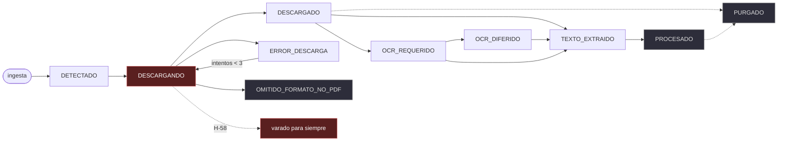

# Contrato de Servicio — Capa 10, Paso 10: Reparar, Verificar y Contar

**Versión:** 1.1.0 · **Redactado:** 2026-08-27 · **Estado:** 🛠️ **Validado por dirección** el
2026-08-27. **Bloque 10.B.1 cerrado**; quedan 10.B.2, 10.B.3, 10.C, 10.D *(verificación)*, 10.E,
10.F y 10.G.

> **Qué cambia en la v1.1.0 y por qué** *(2026-08-27, al implementar el bloque 10.B.1)*. Tres
> cosas, y las tres nacen de escribir el código que debía obedecer al documento — no de releerlo.
> Es la misma familia que la lección del Paso 9: **el papel dice lo que se sabía; el código
> obliga a saber más.**
>
> 1. **El contrato describía el agujero y no lo que empujaba dentro.** La sección B.1 afirmaba
>    que un documento se varaba «si algo interrumpe la descarga», sin decir qué. Al implementar
>    apareció **el disparador**: `_path_for_document()` construía la carpeta `"HCA "` —con espacio
>    final— para el expediente `"HCA 006/2026"`, y Windows no puede crearla. **Son dos defectos
>    encadenados y ninguno bastaba solo.** Se añade la **Operación 0**.
>
> 2. **La Operación 3 —reconciliar los 6 varados— resultó innecesaria, y retirarla es la
>    corrección más útil de esta versión.** Se había previsto una herramienta en `tools/` copiando
>    el procedimiento de H-54. Pero **la propia reparación la subsume**: en cuanto `DESCARGANDO`
>    entra en la consulta de recogida, los 6 ya están en un estado que alguien lee, y la corrida
>    siguiente los procesa sin que nadie migre nada. *Escribir la herramienta habría sido trabajo
>    real produciendo un efecto que ya estaba conseguido* — se conserva de ella lo único que
>    aportaba, que era **verificar el resultado sobre la base real**.
>
> 3. **Aparece una operación que el contrato no tenía: recoger los `Future`.** Es el amplificador
>    del defecto, y sin él la reparación quedaba a medias: los documentos se soltarían, pero el
>    fallo que los varó seguiría evaporándose. Se añade la **Operación 6**.

Corresponde al **Paso 10** de la Capa 10, el último de la capa y del recorrido. Se subordina al
[`CONTRATO_CAPA_10.md`](CONTRATO_CAPA_10.md) v1.3.0, que sigue rigiendo: este documento **no
corrige ni una línea de aquél**.

> **Por qué este paso no es el que estaba escrito, y quién lo cambió.** El README lo definía como
> *«suite E2E, verificación en vivo y `MANUAL.md`»*: **documentar el sistema tal cual**. La
> decisión **D.1.4** de dirección lo invirtió —*«resolver todo lo que se pueda antes de
> lanzar»*—, de modo que el paso **primero repara y después documenta**.
>
> **Y esa decisión se pagó sola el mismo día en que se tomó.** El triaje que obligaba a hacer
> destapó **H-58**: seis pliegos atrapados en un estado que nadie recoge, esa misma mañana, en
> una corrida que consta `COMPLETED` con cero errores. **Se buscaba qué escribir en la sección de
> averías del manual y apareció una avería que se estaba llevando pliegos.**

---

## Propósito

Que el ecosistema se cierre **contando la verdad sobre sí mismo**, y que esa verdad sea lo más
corta posible. La Capa 10 entera existe para que un sistema silencioso no sea un sistema mudo; su
último paso lo lleva al extremo: entregar un manual a personas que no construyeron esto y que no
van a abrir una terminal, describiendo **el sistema que hay** — con las averías ya quitadas donde
se pudo, y nombradas donde no.

---

## A · Decisiones de dirección, tomadas el 2026-08-27

| | Decisión | Alternativa descartada, y por qué |
|---|---|---|
| **A.1 · Lector** | **Cero terminal.** El `MANUAL.md` no menciona una línea de comandos | Se descartó *«dos niveles: cuerpo sin terminal y anexo con comandos»*. Dirección eligió el compromiso duro **sabiendo que obliga a más trabajo**: dar de alta el despertador y preparar un PC nuevo son hoy comandos, así que **necesitan envoltorio de doble clic** o la decisión sería un recorte del alcance disfrazado |
| **A.2 · Idioma** | **Català** | Es el idioma del lector, y en un documento de usuario ese criterio manda sobre la continuidad documental. `MANUAL.md` queda como **el único documento del proyecto en catalán**; el resto sigue en castellano y no se traduce |
| **A.3 · DOGC** | **Apagada, pendiente de reponer** | Se descartó *«fuente retirada, definitivo»*. El manual la presenta como desactivada que volverá si vuelve a publicar, y **sin prometer fecha**: nadie tiene programada su reposición, y prometerla sería inventar un plazo *(Regla 4)* |
| **A.4 · Averías** | **Reparar antes que documentar** | Dirección redirigió la pregunta en vez de contestarla. La sección de limitaciones del manual pasa a ser **el residuo** de lo que no se haya podido arreglar, no un inventario decidido de antemano |

> ⚠️ **A.4 contradice un consejo escrito, a propósito y con motivo.** Los
> [`APUNTES_PASO_10.md`](APUNTES_PASO_10.md) decían *«no reabrir H-56 en este paso: es del motor
> de análisis, no del cierre de la capa»*. **Era buen consejo cuando se escribió** y dejó de
> serlo al medirlo: la causa es un esquema cruzado en la factoría de proveedores, no el motor.
> Cambió el coste, así que cambió la decisión. **Queda anotado que se va contra un consejo
> documentado**, para que quien lea el apunte mañana no crea que se ignoró por descuido.

---

## B · El terreno, medido el 2026-08-27

**Todo lo de esta sección se obtuvo ejecutando, no leyendo.** Es la lección del Paso 9 aplicada
por adelantado: *medir antes de escribir el contrato, no después*.

### B.1 · H-58 · `DESCARGANDO` es el único estado transitorio que nadie recoge

Se auditó **el vocabulario entero** de `documentos.estado`, cruzando lo que se escribe con lo que
se lee. La tabla es el hallazgo:

| Estado | ¿Quién lo escribe? | ¿Quién lo recoge? | Veredicto |
|---|---|---|---|
| `DETECTADO` | `memoria.py:2467`, al ingestar | Cola de descarga *(2471, 2497)* | ✅ |
| **`DESCARGANDO`** | **`lector.py:576`, marca de paso** | **NADIE** | 🚨 **H-58** |
| `DESCARGADO` | `lector.py:549`, `663`; `memoria.py:2526` | Cola de extracción *(2672)* | ✅ |
| `ERROR_DESCARGA` | `memoria.py:2541` | Cola de descarga, con `intentos < 3` *(2497)* | ✅ |
| `TEXTO_EXTRAIDO` | `memoria.py:2695` | Migración a `PROCESADO` *(1203)* | ✅ |
| `OCR_REQUERIDO` · `OCR_DIFERIDO` | `memoria.py:2695` | Cola de OCR *(2726)* | ✅ *(reparado el 2026-08-25, H-53 cara B)* |
| `OMITIDO_FORMATO_NO_PDF` | `lector.py:645` | Nadie | ✅ **Terminal a propósito**: es un descarte deliberado |
| `PROCESADO` · `PURGADO` | `memoria.py:1203`, `2647` | Nadie | ✅ **Terminales a propósito** |

> 🔑 **Lo que hace concluyente a esta tabla es su columna de veredictos.** Hay **cuatro** estados
> que nadie recoge y **tres son correctos**: son finales de camino. `DESCARGANDO` es el único que
> anuncia *«esto está pasando ahora mismo»* y no tiene a nadie esperándolo al otro lado. **Un
> estado transitorio sin recogida no es un final: es un agujero.**

**El daño, sobre la base real:**

| | |
|---|---|
| Documentos atrapados | **6** |
| Cuándo entraron | Corrida **17**, el 2026-08-27, entre las 07:15:42 y las 07:16:04 |
| `intentos` de cada uno | **0** — el contador se incrementa más adelante, así que ni el guardia de reintentos los salvaría |
| Qué son | El PCA, el PPT, el quadre de característiques, la memòria justificativa, la resolució d'aprovació y un ZIP d'annexos |
| Cómo consta esa corrida | **`COMPLETED`, `errores = 0`** |

> 🚨 **Es más grave que sus dos hermanos, y conviene decir por qué.** H-33 y H-53 cara B eran el
> mismo defecto —un estado que nadie reconsulta— y dejaban documentos sin procesar. **Éste lo
> hace mientras la corrida se declara sana**, que es exactamente lo que la Capa 10 existe para
> impedir. El distintivo del Paso 9 tampoco lo delata: no hubo degradación que declarar, porque
> nadie se enteró de que faltaban. **El silencio no estaba en el canal: estaba en que nadie miró.**

### B.2 · H-56 · El esquema que el proveedor impone no es el que el llamador exige

`GeminiProvider.consultar()` fija `responseSchema` a `ESQUEMA_OPENAPI_ANALISIS_SEMANTICO`
—`analista.py:534`— siempre que `usar_schema` esté activo. Y `proveedor_llm_factory()` es **la
misma factoría para los dos consumidores**; su propio docstring lo dice: *«Se utiliza tanto en
AnalistaIA como en AnalistaBoletinesIA (Centinela)»*.

| | Campos |
|---|---|
| Lo que el proveedor **obliga** a responder | `subrogacion`, `revision_precios`, `criterios`, `dictamen`, `version_esquema` |
| Lo que el Centinela **exige** | `es_oportunidad_temprana`, `nivel_interes`, `categoria_fase_temprana`, `resumen_ejecutivo` |
| **Intersección** | **∅** |

Por eso el evento de degradación nombra **los cuatro campos a la vez**, siempre los mismos: no es
un modelo que responde mal, es un modelo **obligado por *structured output* a responder otra
cosa**. Medido en el rastro: `boletin_llm_started` **10**, `boletin_llm_degraded` **10**,
`boletin_llm_succeeded` **0**.

> 📏 **Y no hizo falta gastar cuota para saberlo.** El propio H-56 dejó enunciadas tres hipótesis
> —*«puede ser el prompt, el esquema esperado o el parseo»*— y la segunda se resuelve comparando
> dos objetos del código. **La llamada real sigue haciendo falta, pero para confirmar la
> reparación, no para diagnosticarla.**

**Ollama no participa del defecto y tampoco de la solución**: usa `format: "json"` sin esquema,
así que sólo garantiza JSON válido, no su forma. Es un dato que el contrato debe recoger porque
condiciona el diseño: **el esquema es un concepto del proveedor Gemini, no de la interfaz**.

### B.3 · H-55 · Una carrera entre hilos del mismo proceso, no entre procesos

**18 líneas rotas de 6.354**, y creciendo: eran 14 al cerrar el Paso 9. Se reconstruyó el par
6251 + 6252 esperando que juntas formaran una línea y **no la forman**: la 6251 **parsea entera y
completa por sí sola**, y la 6252 es la cola de *otra* línea cuya cabeza está en otro sitio.

La única secuencia compatible: un escritor deja su cabeza, un segundo cuela una línea entera en
medio, el primero cierra con su cola. Y el sitio lo advierte el propio código:
`GestorTrazabilidadAPI` dice en su docstring que *«se invoca desde el pool de hilos en cada
petición»*. `registrar_evento()` abre en modo `"a"`, escribe y cierra, y ese trío **no es atómico
entre hilos**.

> 🔑 **El diagnóstico decide el tamaño de la reparación, y por eso importa haberlo hecho.** Si
> fuera una carrera **entre procesos** haría falta un cerrojo de fichero del sistema operativo,
> con su manejo de errores y su comportamiento en red. Siendo **entre hilos del mismo proceso**,
> basta un cerrojo de módulo. Es la diferencia entre un bloque y una tarde.

### B.4 · H-53 · Cerrado por instalación, pendiente de verificar en corrida

**Tesseract se instaló el 2026-08-27** y la ruta real del código lo confirma:

| | |
|---|---|
| Binario | `C:\Program Files\Tesseract-OCR\tesseract.exe` *(la ruta que `lector.py:350` autodetecta)* |
| Versión | **v5.5.3.20260724** |
| Idiomas | `cat`, `eng`, `osd`, `spa` — **los dos que el código exige** |
| `ocr_estado` que reporta el Lector | **`ocr_disponible`** |
| `modo_ocr_diferido` | **`False`** |

**Queda pendiente lo único que vale**: que los **4 documentos en `OCR_DIFERIDO` se recuperen
solos** en la corrida siguiente. La consulta ya los busca desde el 2026-08-25 *(H-53 cara B)*,
así que no hay que tocar código — hay que **mirar que ocurra**.

### B.5 · H-41 · Sin reaparecer, pero no cerrado

**8 corridas consecutivas `COMPLETED` con `errores = 0`** (id 12 a 19), y **no hay migaja**
`data/logs/documento_en_curso.json`. Cuatro de ellas ya con el DOGC desactivado.

> ⚠️ **Este contrato NO cierra H-41, y es deliberado.** Ocho corridas limpias no cierran un crash
> intermitente cuya frecuencia nadie ha caracterizado. Se deja en **«no reproducible desde el
> 2026-08-25»**, que es lo que está medido. Declararlo cerrado sería exactamente el tipo de
> afirmación cómoda que la Regla 4 y la Convención C3 prohíben.

### B.6 · Lo que ya estaba hecho, y ahorra medio paso

| | |
|---|---|
| Suite | **688/688** en 91 s |
| Regresiones en `tests/test_capa10_lanzador.py` | **128 recolectadas** — 107 funciones más 4 `parametrize`. *(El README decía 116 y los apuntes 128: la buena es 128, contada recolectando)* |
| Las cinco regresiones que el README exige para este paso | **Existen las seis funciones**, confirmadas una a una |

**Consecuencia para el plan**: el trabajo de este paso **no son las pruebas**. Son los arreglos,
la verificación en vivo y el manual.

---

## C · Máquina de estados del documento (Regla 2)

La reparación de H-58 exige declarar la máquina que hoy sólo vive como comentario. Se declara
**la real**, la que el código ejecuta.

### C.1 · Estados y transiciones permitidas

*La flecha de puntos con `H-58` es el defecto, no una transición: hoy `DESCARGANDO` no lleva a
ninguna parte si la descarga se interrumpe. Los nodos grises son terminales legítimos.*

| Estado | Naturaleza | Quién lo recoge |
|---|---|---|
| `DETECTADO` | Transitorio | Cola de descarga |
| **`DESCARGANDO`** | **Transitorio** | **Cola de descarga** *(lo que este paso añade)* |
| `DESCARGADO` | Transitorio | Cola de extracción |
| `ERROR_DESCARGA` | Transitorio con tope | Cola de descarga, si `intentos < 3` |
| `TEXTO_EXTRAIDO` | Transitorio | Migración a `PROCESADO` |
| `OCR_REQUERIDO` · `OCR_DIFERIDO` | Transitorios | Cola de OCR |
| `PROCESADO` · `PURGADO` · `OMITIDO_FORMATO_NO_PDF` | **Terminales** | Nadie, y es correcto |

### C.2 · La invariante que este paso introduce

> **Todo estado transitorio tiene exactamente un consumidor que lo recoge.**
> Un estado que se escribe y no se lee sólo es admisible si es **terminal declarado**.

**Es la generalización de H-58, H-53 cara B y H-33** — tres veces el mismo defecto en tres puntos
distintos del vocabulario. Sin una invariante escrita, la cuarta es cuestión de tiempo.

### C.3 · Transiciones prohibidas

| Prohibida | Por qué |
|---|---|
| `DESCARGANDO` → *(nada, indefinidamente)* | Es H-58. Todo camino que marque `DESCARGANDO` debe dejarlo en otro estado antes de devolver el control |
| `ERROR_DESCARGA` → `DESCARGANDO` con `intentos` sin incrementar | Reintentaría eternamente sin que el tope de 3 llegara nunca a aplicarse |
| `PURGADO` → cualquiera | La purga es irreversible por diseño *(Capa 9)* |
| `OCR_DIFERIDO` → terminal por omisión | Fue H-53 cara B. Reparado el 2026-08-25; queda como prohibición explícita para que no vuelva |
| Cualquier estado nuevo sin consumidor | Viola la invariante C.2 |

---

## D · Contrato de las operaciones (Regla 1)

### Operación 0 — Que la ruta se pueda crear *(H-58, el disparador)*

| | |
|---|---|
| **Input** | Un componente de ruta suelto: el prefijo, o el identificador saneado |
| **Output** | Un nombre que Windows admite como nombre de carpeta |
| **Precondición** | Ninguna |
| **Postcondición** | Ningún componente acaba en espacio ni en punto, ninguno coincide con un nombre de dispositivo reservado, ninguno queda vacío |
| **Errores** | No lanza: sustituye. Un identificador irrecuperable cae al respaldo `MISC` |
| **Dónde** | `src/lector.py`, `_sanear_componente_ruta()`, aplicado en `_path_for_document()` |

> 🔑 **Va aparte del troceado, y no es una manía de organización.** El defecto no estaba en cómo
> se corta el identificador —cortar por el carácter 4 es una decisión de reparto, y es válida—
> sino en que **nadie comprobaba que el trozo fuera un nombre legal**. Que el resultado se pueda
> crear en disco es una precondición del sistema de ficheros, no del criterio de reparto.

### Operación 1 — Recoger los documentos varados *(H-58)*

| | |
|---|---|
| **Input** | Ninguno. Es una consulta del Lector |
| **Output** | La cola de descarga incluye los documentos en `DESCARGANDO` |
| **Precondición** | Ninguna |
| **Postcondición** | Ningún documento permanece en `DESCARGANDO` tras una corrida completa |
| **Side-effects** | Los 6 varados vuelven al circuito y se descargan |
| **Dónde** | `src/memoria.py`, consultas de las líneas 2471 y 2497 |

⚠️ **El tope de reintentos se aplica también aquí.** `DESCARGANDO` entra en la cola **con el mismo
guardia `intentos < 3`** que `ERROR_DESCARGA`. Sin él, un documento que hiciera morir la descarga
de forma reproducible volvería a intentarse en cada corrida para siempre — se cambiaría un agujero
por un bucle.

### Operación 2 — No volver a varar ninguno *(H-58)*

| | |
|---|---|
| **Input** | El camino de descarga de un documento |
| **Output** | El documento sale siempre en un estado que alguien recoge |
| **Precondición** | El estado se marcó `DESCARGANDO` |
| **Postcondición** | **Ninguna salida del camino de descarga —éxito, error, excepción o retorno temprano— deja `DESCARGANDO` puesto** |
| **Errores** | Si la salida es por excepción no prevista, el estado queda `ERROR_DESCARGA` con el tipo en `error_detalle` *(Convención C2)* |
| **Dónde** | `src/lector.py`, alrededor de la línea 576 |

### Operación 3 — ~~Reconciliar los 6 ya varados~~ · **RETIRADA en la v1.1.0**

Se había previsto una herramienta en `tools/` copiando el procedimiento de H-54. **No hace
falta**: la Operación 1 la subsume. En cuanto `DESCARGANDO` entra en la consulta de recogida, los
6 documentos ya están en un estado que alguien lee, y la corrida siguiente los procesa sin que
nadie migre nada.

> 🔑 **Se retira una operación entera del contrato y conviene decir por qué, no borrarla.** Es
> una diferencia real entre H-54 y H-58, y sólo se ve al implementar: **H-54 dejaba filas
> mintiendo** —reclamaban ficheros borrados—, así que había que ir a corregirlas una a una.
> **H-58 deja filas diciendo la verdad**: el documento *estaba* descargándose y se quedó a
> medias. No hay nada que corregir, sólo alguien que vuelva a por ellas. *Escribir la herramienta
> habría sido trabajo real produciendo un efecto ya conseguido.*

Se conserva de ella **lo único que aportaba**, que pasa a criterio de aceptación: verificar el
resultado sobre la base real, no darlo por bueno.

| | |
|---|---|
| **Postcondición** | `SELECT count(*) FROM documentos WHERE estado='DESCARGANDO'` devuelve **0** tras una corrida real |

### Operación 4 — Que cada llamador imponga su propio esquema *(H-56)*

| | |
|---|---|
| **Input** | `consultar(prompt_sistema, prompt_usuario, timeout, response_schema=None)` |
| **Output** | `raw_response` con la forma que el llamador declaró |
| **Precondición** | Ninguna |
| **Postcondición** | El esquema enviado a Gemini contiene los campos que el DTO del llamador declara obligatorios |
| **Compatibilidad** | `response_schema=None` conserva el comportamiento actual —el esquema del analista— **para no tocar al llamador que ya funciona** *(Regla 14)* |
| **Ollama** | Ignora el parámetro: usa `format: "json"`, que no admite esquema. **Se documenta, no se emula** |
| **Dónde** | `src/analista.py` *(ABC `LLMProvider`, `GeminiProvider`, `OllamaProvider`)* y `src/centinela.py:975` |

> 🔑 **La regresión que lo prueba afirma sobre la PETICIÓN, no sobre la respuesta.** Comprobar que
> el dictamen sale bien exigiría llamar al modelo, y eso lo prohíbe la Convención C5. Lo que sí se
> puede afirmar sin red es que **el esquema que se envía contiene los campos que el DTO exige** —
> y esa prueba habría cazado H-58 el primer día. Es la Convención C4 en su forma más útil:
> *ejercitar la ruta real* sin salir a la red.

### Operación 5 — Escribir una línea entera o ninguna *(H-55)*

| | |
|---|---|
| **Input** | Un evento canónico |
| **Output** | Una línea completa y parseable en `data/pipeline.jsonl` |
| **Precondición** | Ninguna |
| **Postcondición** | **N hilos escribiendo a la vez dejan N líneas parseables**, ninguna partida |
| **Alcance declarado** | **Sólo intra-proceso.** No promete nada sobre dos procesos escribiendo a la vez |
| **Dónde** | `src/rastro.py`, `registrar_evento()` |

⚠️ **Las 18 líneas ya rotas no se tocan.** Borrarlas sería destruir rastro, y el lector del Paso 9
ya las cuenta en vez de saltárselas. Lo que este paso promete es que **no crezcan**.

---

### Operación 6 — Que una excepción de hilo conste *(H-58, el amplificador)*

| | |
|---|---|
| **Input** | Los `Future` que devuelve el pool de descargas |
| **Output** | Cada fallo registrado en el rastro con su tipo |
| **Precondición** | Ninguna |
| **Postcondición** | **Ninguna excepción de hilo se pierde.** Un fallo consta aunque el documento ya lo haya soltado la red de seguridad |
| **Side-effects** | Un `doc_download_excepcion_no_prevista` por fallo. **No aborta el resto**: que un pliego reviente no puede costar la descarga de los demás |
| **Dónde** | `src/lector.py`, `ejecutar_descargas()` |

> 🚨 **Y esto pide una convención que no existe, porque no se parece a lo que la C2 prohíbe.** La
> Convención C2 persigue el `except` amplio que silencia sin registrar. **Un `Future` que nadie
> recoge es lo mismo escrito de otra forma, y es peor: ni siquiera parece un `except`.** No hay
> bloque sospechoso que revisar — hay una línea que parece correcta y un error que se evapora.
> Queda anotado aquí para que el bloque 10.G decida si sube a convención.

## E · Errores tipados

| Error | Cuándo | Estado resultante |
|---|---|---|
| `DocumentoVaradoError` | Un documento lleva en `DESCARGANDO` más de una corrida | `ERROR_DESCARGA` con el motivo |
| `EsquemaIncompatibleError` | El esquema pedido no cubre los campos obligatorios del DTO del llamador | La llamada no se emite. **Se detiene, no se degrada**: emitirla garantizaría un dictamen inservible |
| `BoletinDeserializationError` | Ya existe. El dictamen no trae la forma completa | `ANALISIS_DIFERIDO_BOLETIN`, sin alterar score *(C6)* |

---

## F · Modo Degradado (Regla 5)

| Situación | Comportamiento | Visible en |
|---|---|---|
| Un documento agota los 3 intentos desde `DESCARGANDO` | `ERROR_DESCARGA` terminal por tope, con el motivo | Rastro y Cockpit |
| Gemini responde con esquema correcto pero contenido incompleto | Se degrada como hoy: `ANALISIS_DIFERIDO_BOLETIN`, **sin puntuar en ninguna dirección** *(C6)* | Distintivo del Centinela |
| Tesseract desaparece del equipo | `ocr_ausente` y modo diferido, como hoy | Healthcheck |
| El cerrojo del rastro no se puede tomar | **Se escribe igual y se registra el hecho.** Un rastro con una línea rota es peor que uno con una línea rara, pero **perder el evento es peor que las dos cosas** | Rastro |

---

## G · Eventos JSONL (Regla 3)

Todos en el esquema canónico del Paso 9, con `estado` declarado y no deducido *(la cobertura de
estado declarado sube; es el modo correcto de subirla según el propio Paso 9)*.

| Evento | Componente | Estado | Cuándo |
|---|---|---|---|
| `documento_varado_recuperado` | `lector` | `DEGRADADO` | Un documento se recoge desde `DESCARGANDO` |
| `documento_varado_agotado` | `lector` | `DEGRADADO` | Agota los 3 intentos |
| `llm_esquema_aplicado` | `analista` · `centinela` | `INFO` | Se envía una consulta, con qué esquema |
| `rastro_escritura_contendida` | `rastro` | `INFO` | El cerrojo estaba tomado y hubo que esperar |

---

## H · Versionado (Regla 4)

| Artefacto | De | A | Motivo |
|---|---|---|---|
| Contrato del Paso 10 | — | **v1.0.0** | Este documento |
| Esquema de base de datos | v8 | **v8**, sin cambio | H-58 no añade columnas: cambia **quién lee** un estado que ya existía |
| `MANUAL.md` | — | **v1.0.0** | Nace en este paso |

> **El esquema no sube, y merece decirse.** La tentación era añadir una columna de «varado desde».
> No hace falta: `updated_at` ya fecha la entrada en `DESCARGANDO`. **Una migración que no aporta
> un dato nuevo es riesgo sin contrapartida** *(Regla 14)*.

---

## I · Los siete bloques, y por qué en ese orden

| Bloque | Qué entrega | Verificación que lo cierra |
|---|---|---|
| **10.A · Estado de partida** | 🟢 **Hecho.** Suite, regresiones recolectadas, cifras del README corregidas, H-58 catalogado, H-55 y H-56 diagnosticados | Ya verificado |
| **10.B.1 · H-58** | Operaciones 1, 2 y 3 | `count(*) WHERE estado='DESCARGANDO'` = 0, y los 6 procesados en la corrida siguiente |
| **10.B.2 · H-56** | Operación 4 | La regresión de la petición, más **una llamada real desde `tools/`** que confirme un dictamen completo |
| **10.B.3 · H-55** | Operación 5 | N hilos → N líneas parseables, y el contador de rotas **no sube** tras una corrida real |
| **10.C · Cero terminal** | Envoltorio de doble clic para el despertador y para preparar un equipo nuevo | Ejecutarlos con doble clic, sin consola visible |
| **10.D · Tesseract** | 🟡 **Instalado y verificado**; falta la corrida | Los 4 `OCR_DIFERIDO` pasan a procesados solos |
| **10.E · Verificación en vivo (C7)** | El `.vbs` de verdad | Ninguna consola, Cockpit con datos, tarea disparando corrida real |
| **10.F · `MANUAL.md`** | El manual, en catalán y sin terminal | Que cada cifra que afirme proceda de los bloques anteriores |
| **10.G · Cierre** | README, `ESTADO.md`, auditoría | Capa 10 cerrada, y con ella las diez |

**Por qué B antes que E y F**: los arreglos **cambian lo que el manual tiene que contar**, y la
verificación en vivo debe hacerse sobre el sistema reparado, no sobre el de esta mañana. **Por qué
H-58 el primero de los tres**: es el único que causa daño hoy — cada corrida que pase sin él puede
dejar más pliegos en el agujero.

---

## J · El `MANUAL.md`: qué promete y qué no

**Promete**: qué hace el sistema, qué pasa al hacer doble clic y cuánto tarda, qué significa cada
diálogo y cada código de salida **con qué hacer al verlo**, cómo funciona el despertador y qué
pasa si el PC está apagado esa noche, cómo preparar un equipo nuevo, dónde mirar cuando una noche
no prospectó, y **qué no hace hoy** — el residuo tras el bloque 10.B.

**No promete**: ser documentación técnica, explicar el diseño, ni sustituir al README. **No
menciona una terminal** *(A.1)*. **No promete fechas de reposición del DOGC** *(A.3)*. Y **no
describe el sistema ideal**: si algo queda roto al llegar al bloque 10.F, el manual lo dice.

> 📘 **La regla de redacción, que es la que más fácil se incumple**: el manual habla en **lenguaje
> de síntoma**, no de hallazgo. *«Veràs l'alerta sense anàlisi»*, no *«H-56 está abierto»*. Quien
> lo lea no sabe qué es un hallazgo ni tiene por qué.

---

## K · Lo que este contrato NO promete

* **No cierra H-41.** Ocho corridas limpias no caracterizan un crash intermitente *(B.5)*.
* **No cierra H-52.** OneDrive entre dos equipos sigue mitigado, no resuelto.
* **No promete atomicidad entre procesos** en el rastro *(D, Operación 5)*.
* **No repara las 18 líneas ya rotas.** Promete que no crezcan.
* **No toca el motor de análisis del Centinela** más allá del esquema: si con el esquema correcto
  el dictamen sigue viniendo incompleto, **eso es un hallazgo nuevo**, no parte de éste.
* **No reforma el vocabulario de estados.** Declara la invariante C.2 y repara la violación
  medida; auditar las demás tablas queda fuera.

---

## L · Detectado al redactar este contrato

**Dos cosas, y las dos son de la familia que este proyecto ya conoce: papel que no coincide con el
código.**

1. **El comentario que declara el vocabulario de estados está equivocado en las dos direcciones.**
   `src/memoria.py:500` declara *«DETECTADO, DESCARGANDO, DESCARGADO, PROCESADO, ERROR_DESCARGA,
   OCR_PENDIENTE, ERROR_EXTRACCION»*. De esos, **`OCR_PENDIENTE` y `ERROR_EXTRACCION` no se
   escriben nunca**, y **faltan cinco que sí**: `TEXTO_EXTRAIDO`, `OCR_REQUERIDO`, `OCR_DIFERIDO`,
   `OMITIDO_FORMATO_NO_PDF` y `PURGADO`.

   > 🔑 **Y es probablemente por qué H-58 pasó desapercibido tanto tiempo.** Quien fuera a
   > comprobar si `DESCARGANDO` tenía consumidor leyendo ese comentario habría visto una lista
   > corta y plausible. **El único sitio del código que dice cuál es el vocabulario dice uno que
   > no existe.** Se corrige en el bloque 10.B.1, junto a la invariante C.2.

2. **Un defecto cosmético en la detección de Tesseract.** `lector.py` imprime *«versión:
   tesseract»* en vez de *«5.5.3»*, porque hace `split(' ')[0]` sobre `"tesseract v5.5.3..."`.
   No afecta a ninguna decisión —`self.tesseract_version` guarda la cadena entera— pero se ve en
   pantalla al arrancar. **Se anota, no se arregla aquí**: es de otra capa y no cambia nada.

---

## M · Criterios de aceptación del Paso 10

El paso se cierra cuando **los nueve** se cumplen:

1. `SELECT count(*) FROM documentos WHERE estado = 'DESCARGANDO'` devuelve **0** tras una corrida
   real, y los 6 varados constan procesados.
2. Existe la regresión que **falla** si se retira `DESCARGANDO` de la cola de recogida.
3. Existe la regresión que afirma que **el esquema enviado cubre los campos obligatorios del DTO
   del llamador**, y falla si se vuelve a fijar un esquema único.
4. **Una llamada real desde `tools/`** produce un dictamen completo del Centinela:
   `boletin_llm_succeeded` deja de ser 0 por primera vez en el proyecto.
5. El contador de líneas rotas del rastro **no sube** tras una corrida real, y la regresión de N
   hilos pasa.
6. Los **4 documentos en `OCR_DIFERIDO`** se procesan solos en la corrida siguiente.
7. **El despertador y la preparación de un equipo nuevo se ejecutan con doble clic**, sin consola.
8. **Verificación C7**: el `.vbs` de verdad, sin ninguna consola a la vista, Cockpit con datos, y
   la tarea programada disparando una corrida real que termine bien.
9. `MANUAL.md` existe, en catalán, **sin mencionar una terminal**, y **cada cifra que afirma
   procede de los bloques anteriores** — ninguna deducida.

> ⚠️ **El criterio 9 es el que se incumple sin darse cuenta.** Es fácil escribir *«tarda un parell
> de minuts»* porque suena bien. Lo medido: las corridas van de **36 s a 8,1 minutos**, y las de
> hoy fueron de 63 s, 133 s, 44 s y 149 s. **Un manual que inventa un plazo es un manual que
> empieza a mentir por la parte más inocente.**
