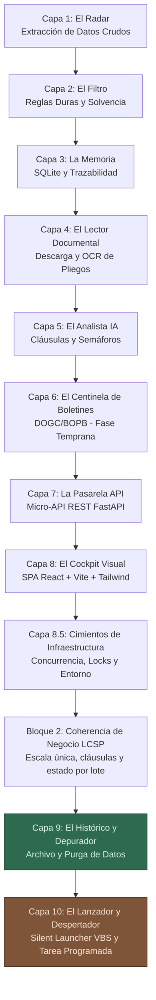
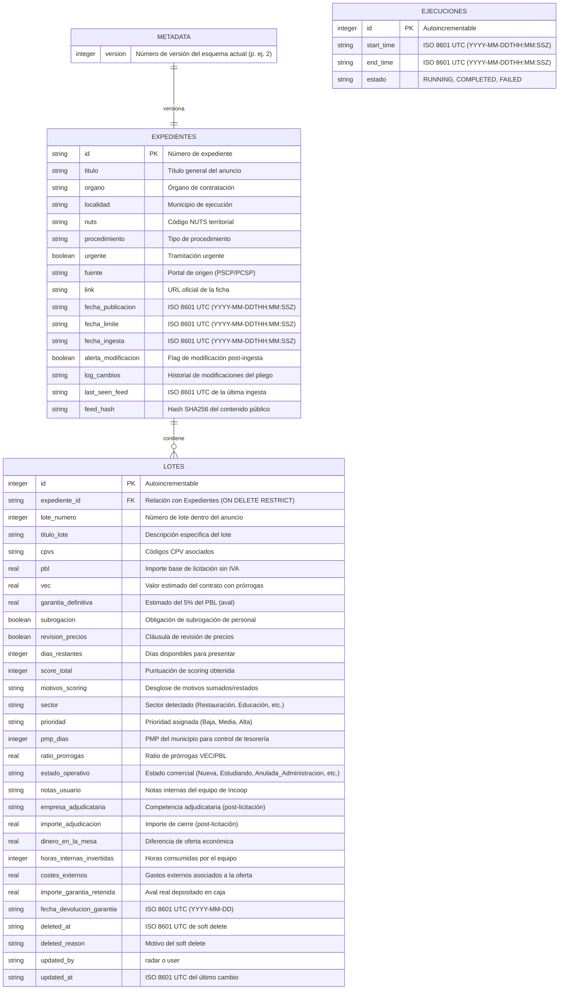
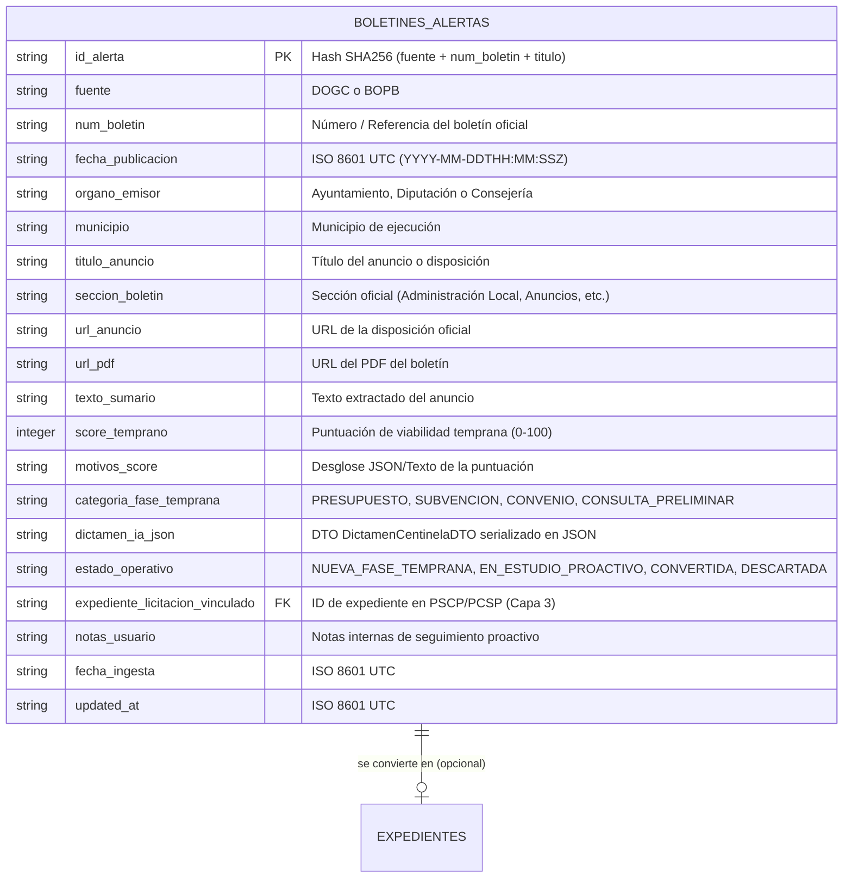
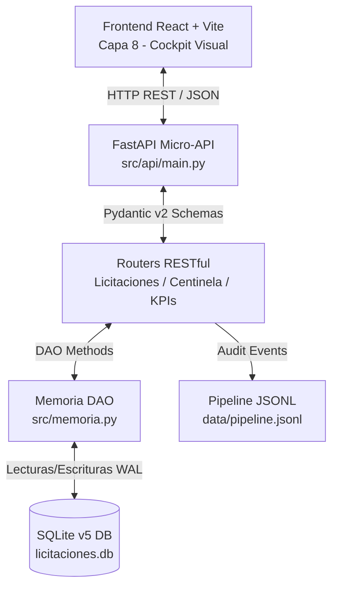
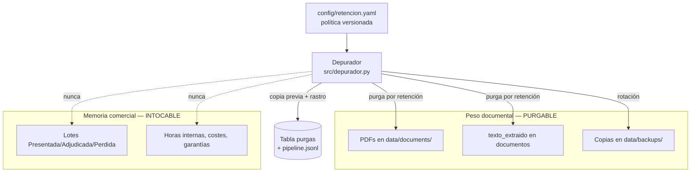

# 📡 Ecosistema Automático de Licitaciones (bfr_incoop)

> **Estado del producto: Beta 0.3 (2026-08-12).** **Las Capas 1 a 9 están completadas y
> validadas**, y la Capa 10 —el lanzador silencioso— es la activa. El 2026-08-12 se ejecutó la
> **primera corrida real del pipeline completo**: 12 expedientes captados, 88 documentos
> detectados, 63 pliegos descargados y leídos, 10 análisis semánticos del LLM y 0 errores.
> No debe tomarse una decisión de licitación sin verificar el pliego y las fuentes oficiales.
>
> **Remediación**: los Bloques 1 (cimientos de infraestructura) y 2 (coherencia de negocio LCSP)
> están cerrados, con la suite en **334/334** y los **36 hallazgos** catalogados cerrados, sin
> ninguno abierto. El esquema vigente es **v7** y la política de retención, **v1.2.0**. El Cockpit
> compila limpio con `tsc -b` en modo estricto y su bundle está al día.
>
> ⚠️ **Desde la Capa 9, cada corrida del pipeline archiva y purga**: no sólo lee, también **borra
> ficheros del disco** según la política de retención. Es deliberado y está auditado en la tabla
> `purgas`, pero conviene saberlo antes de automatizar su ejecución.
>
> **Repositorio**: https://github.com/DonBorgiFR/licit-accion · **Estado detallado por capas,
> hallazgos y decisiones**: [`.agents/`](.agents/) — `AGENTS.md` es el punto de entrada.

## 🎯 Objetivo del Proyecto

Construir un **sistema automatizado de inteligencia de licitaciones** que permita a **Incoop** detectar, filtrar y analizar oportunidades de contratación pública de forma sistemática, reduciendo drásticamente el tiempo de prospección y mejorando la tasa de acierto en la selección de licitaciones a las que presentarse.

### El problema que resuelve

Las plataformas oficiales de contratación pública en España (PCSP estatal y PSCP autonómica en Catalunya) publican **miles de licitaciones al año**. Para una empresa como Incoop, el proceso actual de prospección es:

1. **Manual y reactivo**: alguien revisa periódicamente los portales buscando oportunidades.
2. **Propenso a errores de omisión**: se pierden licitaciones por no revisar a tiempo o por volumen.
3. **Costoso en tiempo**: leer pliegos completos de licitaciones que finalmente no encajan consume horas de perfiles cualificados.
4. **Sin memoria histórica**: no existe un registro estructurado de qué se ha revisado, qué se ha descartado y por qué.

Este ecosistema transforma ese proceso artesanal en un **pipeline automatizado** que va desde la extracción de datos crudos hasta la notificación inteligente al equipo.

### Marco regulatorio

El sistema opera sobre licitaciones regidas por la **Ley 9/2017, de 8 de noviembre, de Contratos del Sector Público (LCSP)**, que transpone las Directivas europeas 2014/23/UE y 2014/24/UE. Los datos se obtienen exclusivamente de fuentes públicas oficiales (feeds RSS/Atom de los perfiles de contratante), cumpliendo con el principio de **publicidad y transparencia** recogido en el artículo 63 de la LCSP.

---

## 🔭 Alcance General del Ecosistema

### Qué incluye (IN scope)

| Área | Descripción |
|------|-------------|
| **Fuentes de datos** | Feeds RSS/Atom de la PSCP (Generalitat de Catalunya) y PCSP (Estado) |
| **Tipos de contrato** | Contratos de servicios y consultoría alineados con el perfil de Incoop |
| **Análisis** | Extracción de metadatos, filtrado por reglas de negocio, lectura automatizada de pliegos y análisis semántico con IA |
| **Persistencia** | Base de datos local con historial de licitaciones y su estado operativo |
| **Notificación** | Alertas automáticas al equipo con las oportunidades viables detectadas |
| **Entorno** | Sistema local *local-first* compuesto por un pipeline Python de línea de comandos, una micro-API REST (FastAPI) y un Cockpit visual en navegador (React SPA), todo ejecutándose en el equipo del usuario |

### Qué NO incluye (OUT of scope)

- ❌ **Presentación automatizada de ofertas**: el sistema informa y recomienda, pero la decisión y preparación de la oferta es humana.
- ❌ **Scraping de portales web**: solo se consumen fuentes de datos estructuradas (RSS/Atom), no se hace crawling de páginas HTML.
- ❌ **Cobertura de todas las CCAA**: en la primera versión, el alcance geográfico se limita a Catalunya (PSCP) y Estado (PCSP).
- ❌ **Aplicación web publicada o app móvil**: el Cockpit visual (Capa 8) es una SPA React que se sirve **en local** contra la API de la Capa 7; no se despliega en Internet, no es multiusuario y no hay versión móvil.
- ❌ **Licitaciones de otros poderes adjudicadores**: municipios, universidades o entes con plataformas propias fuera de PSCP/PCSP quedan fuera inicialmente.

---

## 🖥️ Requisitos del Sistema

> **Principio rector**: la herramienta debe funcionar en **cualquier PC del equipo**, no sólo en el del desarrollador. Por eso ningún requisito de hardware especializado puede ser obligatorio.

| Componente | Requisito / Configuración | Propósito en el Ecosistema |
|---|---|---|
| **Proveedor IA** | **Google Gemini API** (`GEMINI_API_KEY` en entorno) | **Proveedor preferente y único requerido.** Aporta `responseSchema` OpenAPI, que fuerza la estructura de la respuesta y es lo que garantiza que el dictamen jurídico sea explotable. |
| **GPU Dedicada** *(opcional)* | NVIDIA GeForce RTX 5070 (12 GB VRAM) | **No es requisito.** Sólo se usa si se activa el proveedor local Ollama. |
| **Servidor IA Local** *(opcional)* | Ollama en `http://localhost:11434` | Proveedor alternativo **desactivado por defecto**. Ver nota abajo. |
| **Motor OCR** | **Tesseract OCR v5+** (`cat+spa`) | Motor de extracción diferida para PDFs escaneados y fallback de visión. |
| **Entorno Python** | Python 3.10+ en entorno virtual (`venv` / `uv`) | Ejecución determinista del pipeline y suite de pruebas unitarias. |
| **Base de Datos** | **SQLite 3.35+** en modo WAL (Write-Ahead Logging) | Persistencia local ligera con bloqueo seguro transaccional (`licitaciones.db.lock`). |

> [!IMPORTANT]
> **Decisión de arquitectura — Gemini como proveedor preferente (sustituye al enfoque Local-First original)**
>
> El diseño inicial situaba Ollama (`llama3.1:8b` sobre RTX 5070) como proveedor preferente. Se revierte por dos motivos:
>
> 1. **Portabilidad**: la herramienta está destinada a varios equipos de la cooperativa que no disponen de GPU dedicada. Un requisito de hardware no replicable convierte la herramienta en no distribuible.
> 2. **Garantía de esquema**: Gemini acepta `responseSchema` (OpenAPI) y **fuerza** la estructura de la respuesta. Ollama sólo ofrece `format: json`, que garantiza JSON sintácticamente válido pero **no** la forma correcta — precisamente el fallo que producía dictámenes vacíos dados por buenos.
>
> Ollama **no se elimina**: se conserva tras la interfaz abstracta `LLMProvider` y puede activarse en `config/analista_config.yaml` en equipos con GPU. Simplemente deja de ser obligatorio y deja de ser el preferente.

---

## ▶️ Cómo Ejecutar el Sistema

> Se recomienda lanzar los comandos desde la raíz del proyecto, pero desde el 2026-08-06 **ya no es obligatorio**: `config/` y `data/` se resuelven contra la raíz del repositorio, no contra el directorio de trabajo (ver hallazgo H-18). Antes, ejecutar desde otra carpeta cargaba el perfil comercial vacío y puntuaba distinto sin avisar.

### 1. Pipeline de captación (Capas 1 a 6)

```bash
python run.py
```

Opciones útiles: `--dry-run` (no escribe en base de datos), `--skip-centinela` (omite boletines DOGC/BOPB), `--batch-size N`.

Equivale a `python -m src.main`. **No** debe ejecutarse como `python src/main.py`: esa forma rompe la resolución del paquete `src`.

### 2. Pasarela API (Capa 7)

```bash
python -m uvicorn src.api.main:app --reload --port 8000
```

Documentación interactiva en `http://127.0.0.1:8000/docs`.

### 3. Cockpit Visual (Capa 8)

```bash
cd frontend && npm run dev
```

Disponible en `http://localhost:5173`. Requiere la API de la Capa 7 en marcha. Tiene cuatro
pestañas: **Dashboard KPIs**, **Funnel PSCP**, **Centinela** y **Administración** —esta última es
la pantalla del Depurador (Capa 9): ocupación de disco, política de retención vigente, historial
de prospecciones y purga en dos tiempos.

### 4. Suite de pruebas

```bash
python -m pytest tests/ -q
```

---

## 🏢 Perfil de Negocio de Incoop (Configuración del Radar)

> Esta sección define los parámetros que alimentan la Capa 2 (El Filtro) y la Capa 5 (El Analista). Cualquier cambio en la estrategia comercial de la cooperativa debe reflejarse aquí y en el fichero `config/perfil_incoop.yaml`.

### Identidad

**Incoop, SCCL** es una cooperativa de treball i de consum sense ànim de lucre con más de 28 años de experiencia, dedicada a generar, diseñar, gestionar y desarrollar **proyectos y servicios educativos, culturales y sociales** en Catalunya. Facturación anual estimada: **~11M €** (2023).

### Sectores de actividad y códigos CPV (Calibración Consolidada)

| Sector | Ejemplos de servicio | Códigos CPV calibrados (Core & Familias) |
|---|---|---|
| **Servicios educativos y de formación** | Escoles bressol, ludotecas, casals d'estiu, extraescolars, formación de adultos | 80000000, 80100000, 80110000, 80200000, 80300000, 80400000, 85312110 |
| **Servicios sociales y atención a las personas** | Casals de gent gran, atenció domiciliària, centres oberts, atención a la dependencia | 85300000, 85310000, 85311000, 85312000, 85312100, 85320000 |
| **Servicios comunitarios y asociativos** | Gestión de casals de joves, dinamización comunitaria, entidades sociales y cooperativas | 98000000, 98100000, 98130000, 98300000, 75200000 |
| **Servicios culturales y equipamientos** | Gestión de centres cívics, bibliotecas, museos, dinamización cultural y eventos | 92000000, 92500000, 92510000, 92520000, 79952000 |
| **Restauración colectiva** | Menjadors escolars, càtering social y comedores comunitarios | 55520000, 55523100, 55524000 |
| **Mantenimiento de equipamientos** | Limpieza y mantenimiento de centros públicos gestionados por Incoop | 90910000, 50700000 |
| **Consultoría y asistencia técnica local** | Asesoramiento a entidades sociales, cooperativas y apoyo administrativo | 79400000, 75120000, 75130000, 85312300 |

> **Nota de Calibración**: Los códigos CPV han sido revisados e incorporados al catálogo en `config/perfil_incoop.yaml`. El motor `src/filtro.py` los evalúa mediante prefijos de 3 y 5 dígitos (con **+40 pts** para coincidencia Core y **+30 pts** para fallbacks de división social/comunitaria).

> [!TIP]
> **📌 Espíritu Colectivo de Incoop y Calibración Continua de CPVs y PMP**:
> Como cooperativa de iniciativa social y sin ánimo de lucro con más de 28 años de trayectoria, la selección de CPVs refleja fielmente la misión de **Incoop**: la transformación social a través de proyectos educativos, de atención a las personas, culturales y de dinamización comunitaria. Los CPVs definidos maximizan la bonificación comercial (+40 pts) en los pilares estratégicos de la cooperativa. Asimismo, el sistema mantiene activos los penalizadores de Periodo Medio de Pago (PMP) e indicadores de morosidad para proteger el *working capital* de Incoop ante administraciones locales con retrasos recurrentes en el cobro.

### Parámetros de filtrado (Capa 2)

| Parámetro | Valor | Justificación |
|---|---|---|
| **Presupuesto mínimo** | 35.000 € | Se reduce el umbral duro para capturar contratos simplificados de rápida preparación, penalizándolos con -15 pts en el scoring si son inferiores a 100.000 € (priorizando los de gran volumen pero manteniendo visibles los pequeños de alta afinidad) |
| **Presupuesto máximo** | 2.000.000 € | Incoop factura ~11M €; contratos superiores a 2M € pueden requerir UTE o superar la capacidad operativa de la cooperativa |
| **Ámbito geográfico** | Catalunya (PSCP) + Estado (PCSP) | **Foco Operativo Preferente**: Prioridad máxima en Barcelona, Barcelonès y Corona Metropolitana / Alrededores (+35 pts en scoring); cobertura general en el resto de Catalunya (+20 pts) sin descartes duros para no limitar oportunidades estratégicas |
| **Procedimientos LCSP** | Abierto (Art. 156) + Abierto Simplificado y Súper Simplificado (Art. 159) | Son los procedimientos donde las cooperativas de iniciativa social y Pymes compiten en igualdad de condiciones |

### Exclusiones automáticas (palabras clave negativas)

El sistema descartará automáticamente las licitaciones cuyo objeto o tipo de contrato coincida con:

| Exclusión | Tipo de contrato LCSP | Razón |
|---|---|---|
| **Obras y construcción** | Contrato de obras | Incoop gestiona servicios, no construye |
| **Suministros de bienes** | Contrato de suministros | Mobiliario, equipos informáticos, material — no es el core |
| **Ingeniería y arquitectura** | Servicios técnicos | Fuera del perfil competencial |
| **Desarrollo de software / TIC** | Servicios tecnológicos | No es una tecnológica |
| **Seguridad privada y vigilancia** | Servicios de seguridad | Requiere habilitación específica |
| **Servicios sanitarios clínicos** | Servicios sanitarios | Hospitales, ambulancias — fuera del ámbito social/educativo |

### Cláusulas críticas para el análisis de pliegos (Capa 5)

Cuando el Analista IA lea un pliego, deberá extraer y evaluar estas cláusulas por su impacto directo en la decisión de presentarse:

| Cláusula | Artículo LCSP | Por qué importa a Incoop |
|---|---|---|
| **Subrogación de personal** | Art. 130 | Determina el coste real de personal heredado; puede convertir un contrato rentable en deficitario si la plantilla tiene mucha antigüedad |
| **Revisión de precios** | Art. 103 | En contratos plurianuales (2-4 años), si no hay revisión por IPC o convenio colectivo, la inflación erosiona el margen año a año |
| **Garantía definitiva** | Art. 107-108 | Por la Paradoxa de Caixa de Incoop (solo ~38k € de caixa líquida en 2023), saber si se puede usar seguro de caución vs. depósito en efectivo es crítico |
| **Peso precio vs. calidad** | Art. 145 | Si el precio pesa más del 60% en la adjudicación, la licitación se convierte en una guerra de precios donde Incoop tiene desventaja frente a grandes empresas |
| **Penalidades y resolución** | Art. 192-194 | Penalidades desproporcionadas o cláusulas de resolución agresivas elevan el riesgo contractual |
| **Cláusulas sociales** | Art. 202 | **Ventaja competitiva**: como cooperativa de iniciativa social, Incoop puede capitalizar criterios de inserción laboral, igualdad y economía social que otras empresas no cumplen de forma natural |

---

## 🛤️ Principios de Diseño para la Adaptabilidad

Este proyecto no es una herramienta puntual: es un **sistema operativo de negocio** que debe funcionar de forma continuada y sobrevivir al cambio. Los siguientes principios identifican los puntos más vulnerables y las estrategias para que el sistema se adapte sin romperse.

### Puntos vulnerables y estrategias

| Punto vulnerable | Por qué cambia | Estrategia de adaptabilidad |
|---|---|---|
| **URLs y esquemas de los feeds RSS** | Las plataformas públicas actualizan sus APIs sin previo aviso ni changelog | Las URLs y las reglas de parseo se almacenan en un fichero de configuración externo (`config/fuentes.yaml`), nunca hardcoded. Un **healthcheck** al inicio de cada ejecución verifica que cada feed responde y contiene la estructura esperada, alertando si algo ha cambiado |
| **Perfil de negocio de Incoop** | Los sectores objetivo, los CPVs y los umbrales económicos evolucionan con la estrategia comercial de la cooperativa | El perfil se define en un fichero independiente (`config/perfil_incoop.yaml`) que cualquier persona del equipo puede editar sin tocar código. El sistema lee ese perfil en cada ejecución |
| **Formato de los PDFs de pliegos** | Cada órgano de contratación genera PDFs con estructuras distintas; algunos son escaneos (imagen), otros texto nativo | La Capa 4 (Lector) se diseña con un **patrón adaptador**: primero intenta extracción de texto directo (rápido y fiable); si detecta páginas sin texto, escala a OCR. Ambas rutas son intercambiables |
| **Modelos de IA para análisis semántico** | Los modelos evolucionan rápidamente (GPT → Claude → Gemini → modelos locales); hoy el mejor puede no ser el mejor mañana | La Capa 5 (Analista) se comunica con la IA a través de una **interfaz abstracta** (un contrato de entrada/salida). Cambiar de modelo significa cambiar una sola configuración, no reescribir la lógica |
| **Nuevas fuentes de datos** | Mañana Incoop puede querer vigilar otras CCAA, o la UE, o plataformas sectoriales | Cada fuente es un **módulo independiente** que cumple un contrato común (devolver una lista normalizada de licitaciones). Añadir una fuente nueva es crear un nuevo módulo, no modificar los existentes |

### Regla general

> **Lo que es probable que cambie vive en ficheros de configuración. Lo que es posible que cambie vive detrás de una interfaz abstracta. Lo que no va a cambiar es lo único que se puede poner en el código directamente.**

---

## 🗺️ Mapa de Ruta por Capas (Roadmap)

El desarrollo sigue una metodología estrictamente secuencial (**bottom-up**): cada capa se diseña, implementa y valida antes de pasar a la siguiente. Esto permite construir sobre cimientos probados y ajustar el rumbo en cada etapa.

**En verde, la última capa cerrada (la 9); en marrón, la activa (la 10).** Las anteriores están todas completadas y validadas.



> **¿Por qué esta secuencia ampliada?** 
> 1. **La Memoria (Capa 3)** almacena la información estructurada de inmediato tras el filtro rápido para no reprocesar.
> 2. **El Centinela de Boletines (Capa 6)** monitoriza aprobaciones iniciales en boletines oficiales para el canal proactivo, capturando proyectos en fase temprana (antes de la licitación formal) y reutilizando el motor LLM de la Capa 5.
> 3. **La Pasarela API (Capa 7)** actúa como la frontera tecnológica: expone SQLite mediante una micro-API REST local (FastAPI + Pydantic v2) que el navegador consume, y recoge las decisiones tomadas en la UI para reinyectarlas en el motor de persistencia. *(Nota: el diseño original planteaba un exportador a fichero estático `dashboard_data.js`; se sustituyó por una API REST para permitir mutaciones transaccionales desde la UI, imposibles con un fichero plano.)*
> 4. **El Cockpit (Capa 8)** proporciona la cara humana del sistema mediante una SPA local-first premium (React + Vite + Tailwind + TanStack).
> 5. **El Histórico e Historial (Capa 9)** nos permite depurar el sistema, agrupar ejecuciones anteriores y dotar a la cooperativa del botón de "Borrar/Purgar" para limpiar registros antiguos sin comprometer la integridad.
> 6. **El Lanzador Silencioso (Capa 10)** elimina la necesidad de consolas o comandos: un script VBS silencioso al hacer doble clic, y una tarea programada de Windows que prospecta sola cada mañana. **No incluye avisos activos** *(decisión de dirección, 2026-08-12)*: el canal por el que el sistema habla es el Cockpit, que ya existe.

---

## 📡 Capa 1: El Radar (Extracción y Normalización de Datos Crudos)
* **Estado actual**: 🟢 Completado y Validado (100%).

### 🎯 Objetivo
Conectarse de forma automática, estructurada y resiliente a las fuentes públicas de contratación estatal y autonómica para descargar, normalizar y consolidar en un formato común los metadatos básicos de las licitaciones vigentes.

### 🔍 Alcance e Implementación Técnica
El Radar está implementado en [src/radar.py](src/radar.py) y cuenta con los siguientes componentes:

1. **Gestión de Múltiples Fuentes (Configuración Externa)**:
   * Las URLs y estados de conexión se configuran de forma externa en [config/fuentes.yaml](config/fuentes.yaml).
   * **PCSP Estatal**: Descarga del feed XML Atom oficial `sindicacion_643` (Licitaciones de Perfiles del Contratante completos).
   * **CCAA Agregadas**: Descarga del feed XML Atom oficial `sindicacion_1044` (Comunidades Autónomas Agregadas).
   * **API de Datos Abiertos de Catalunya (Socrata)**: Consulta nativa JSON SoQL al dataset `ybgg-dgi6` de la Generalitat de Catalunya, permitiendo lecturas eficientes de los lotes publicados.

2. **Motor de Normalización Unificada**:
   * Convierte y estandariza las estructuras heterogéneas de datos (árbol XML del estándar europeo UBL/CODICE y diccionarios JSON de Socrata) en un esquema interno uniforme:
     * **Identificación**: Número de expediente, Título, Órgano de Contratación.
     * **Financiero**: PBL (Importe base sin IVA) y VEC (Valor estimado con prórrogas) por separado.
     * **Geográfico**: Mapeo de códigos territoriales NUTS y nombres planos de municipio (Localidad a través de `<cbc:CityName>` en XML y `lloc_execucio` en Socrata).
     * **Operativo y Riesgos**: CPVs, tipo de procedimiento, detección preliminar de subrogación de personal, detección de revisión de tarifas, tramitación urgente y loteado de expedientes.

3. **Resiliencia de Conexión**:
   * Control estricto de excepciones de red con límites de tiempo (*timeouts* de 15 segundos). Si el servidor de datos abiertos de Cataluña o del Estado sufre una caída de servicio o lentitud en la carga, el sistema captura el error y continúa procesando el resto de fuentes disponibles de forma parcial y limpia.

### 🛠️ Ficheros Creados
*   [src/radar.py](src/radar.py): Motor de descarga y parseo de XML/JSON.
*   [config/fuentes.yaml](config/fuentes.yaml): Listado de plataformas y endpoints.

---

## 🧹 Capa 2: El Filtro (Sistema de Scoring y Calibración Financiera)
* **Estado actual**: 🟢 Completado y Validado (100%).

### 🎯 Objetivo
Limpiar el ruido e identificar oportunidades de alta viabilidad comercial para Incoop mediante reglas duras de descarte inmediato y un sistema de scoring financiero y operativo adaptativo.

### 🔍 Alcance e Implementación Técnica
El motor desarrollado en `src/filtro.py` evalúa cada licitación bajo dos fases:

1. **Filtros Duros (Descarte Inmediato)**:
   * **Presupuesto**: Excluye licitaciones por debajo de **35.000 €** (simplificados de muy bajo margen) o superiores a **2.000.000 €** (exceso de capacidad).
   * **Tipos de Contrato**: Excluye Obras, Suministros, TIC, Seguridad o Sanitario.
   * **Palabras Negativas**: Descarte inmediato ante objetos incompatibles (ej. *construcción*, *suministro*, *software*).

2. **Filtros Blandos (Sistema de Scoring Ponderado)**:
   * **Presencia Histórica Directa**: **+40 pts** si el municipio, barrio o distrito ya es territorio operativo de Incoop (tiene prioridad sobre el resto de criterios geográficos).
   * **Afinidad Territorial**: **+35 pts** por Barcelona y corona metropolitana; **+20 pts** por el resto de Catalunya. Se resuelve primero por código NUTS y, si no está informado, por nombre de municipio.
   * **Órgano de Contratación Afín**: **+20 pts**.
   * **Afinidad de Actividad (CPV)**: **+40 pts** por CPV Core del catálogo sectorial; en su defecto, por división: **+30** social (853) y comunitario (98), **+25** educación (80), cultural (92) y comedores (555), **+20** administración (75) y limpieza/mantenimiento (909/507), **+10** consultoría (79).
   * **Procedimiento**: **+10 pts** si es Abierto o Simplificado; **−15 pts** en caso contrario.
   * **Palabras de Interés**: **+25 pts** por palabra núcleo (ej. *escola bressol*, *casal*) y **+10 pts** por palabra secundaria.
   * **Penalización de Contratos Pequeños**: **−15 pts** si el presupuesto base es inferior a **100.000 €**.

> [!TIP]
> **Contrato de scoring v2 — escala canónica 0–100**
> Las señales ponderadas internas se normalizan contra el máximo bruto declarado en
> `config/perfil_incoop.yaml`; `score_total`, API, Cockpit y Recalibrador sólo intercambian un
> entero entre 0 y 100. Los umbrales de prioridad son **65** (alta) y **40** (media). El score
> bruto se conserva en el resultado del filtro para auditoría, pero nunca se persiste ni presenta
> como puntuación comercial.

3. **Inteligencia Financiera y Operativa Avanzada**:
   * **Semáforo de Tesorería (PMP)**: Cruza el órgano de contratación con el Periodo Medio de Pago de Hacienda en [config/pmp_ayuntamientos.csv](config/pmp_ayuntamientos.csv). Suma **+10 pts** si el ayuntamiento paga en ≤ 30 días y resta **-20 pts** si paga en ≥ 60 días.
   * **Ratio de Prórrogas (VEC vs PBL)**: Premia con **+15 pts** si el Valor Estimado del Contrato con prórrogas duplica al Presupuesto Base de Licitación inicial (VEC/PBL ≥ 2.0).
    * **Subrogación de Personal y Revisión de Precios**: El feed sólo genera una **señal de lectura**. No resta ni suma puntos: la Capa 5 decide una única vez sobre evidencia del pliego, evitando tanto negaciones mal interpretadas como doble penalización.
   * **Urgencia e Importe Restante**: Resta **-15 pts** si el expediente es urgente o quedan menos de 5 días para presentar la solvencia técnica en licitaciones de gran volumen (≥ 200.000 €).
   * **División en Lotes**: Suma **+10 pts** si el contrato se divide en lotes independientes, lo que permite licitar de forma parcial y mitigar el riesgo.
   * **Estimación de Retención de Avales**: Proyecta automáticamente un inmovilizado financiero del **5% del PBL** para anticipar el coste financiero de la garantía definitiva.

### 🛠️ Ficheros Creados
*   [src/filtro.py](src/filtro.py): Motor del Filtro y Scoring.
*   [config/pmp_ayuntamientos.csv](config/pmp_ayuntamientos.csv): Base de datos local de periodos medios de pago.
*   [config/perfil_incoop.yaml](config/perfil_incoop.yaml): Parámetros, umbrales y palabras clave de negocio.

---

## 💾 Capa 3: La Memoria (Registro, Persistencia y Trazabilidad Analítica)
* **Estado actual**: 🟢 Completada.

### 🎯 Objetivo
Persistir de forma estructurada en una base de datos local SQLite (`data/licitaciones.db`) las licitaciones y lotes detectados por el radar, garantizando el control de duplicados, la trazabilidad del scoring y el almacenamiento de variables críticas para Control de Gestión (CAC, PMP, competencia e inmovilizado).

### 🔍 Consideraciones Críticas de Diseño e Inteligencia de Negocio
Para alcanzar el nivel de robustez analítico que buscamos como Controller, el modelo de datos responde a estas cinco dimensiones críticas atajando vulnerabilidades técnicas de SQLite:

1. **Gestión Multilote (Relación $1:N$)**:
   * *El reto*: Las licitaciones públicas se dividen frecuentemente en lotes independientes (p. ej. *Lote 1: Casal Distrito 1*, *Lote 2: Casal Distrito 2*). El estado de estudio, los CPVs específicos y el scoring comercial deben ir a nivel de lote.
   * *La solución*: Estructurar la base de datos en dos tablas: `expedientes` (datos comunes del anuncio) y `lotes` (datos específicos de presupuesto, subrogación, scoring, costes y estado comercial).

2. **Inteligencia Competitiva (Cierre de Círculo en Post-Licitación)**:
   * *El reto*: Si Incoop pierde un concurso, necesitamos registrar de forma estructurada contra quién se ha perdido y a qué precio, para alimentar en el futuro las horquillas de "Baja Temeraria" y auditar el comportamiento de la competencia.
   * *La solución*: Añadir en `lotes` campos para guardar la `empresa_adjudicataria`, el `importe_adjudicacion` y la métrica de `dinero_en_la_mesa` (diferencia monetaria entre la oferta de Incoop y la ganadora).

3. **Gestión de Rectificaciones (El Chivato de Cambios con Diagnóstico)**:
   * *El reto*: La administración suele modificar importes (VEC) o aplazar fechas límites tras la publicación original. Si el equipo técnico estudia un pliego y el radar actualiza los datos en silencio, se provocan fallos humanos por asimetría de información.
   * *La solución*: El radar comparará los datos entrantes con el registro original de SQLite. Si detecta variaciones en la fecha límite o en el VEC tras haber sido clasificada por el usuario, activará `alerta_modificacion = True` en `expedientes` y concatenará en `log_cambios` el historial de lo que cambió exactamente (p. ej. `"[2026-07-11] VEC modificado de 150.000 a 140.000 €; Fecha límite pospuesta al 2026-07-28"`).

4. **El Coste de Adquisición (CAC Público) y Blindaje contra Borrados Físicos (Soft Delete)**:
   * *El reto*: Si una administración anula o retira una licitación y el radar aplica un `ON DELETE CASCADE`, se destruirán los lotes asociados y el histórico de `horas_internas_invertidas` y `costes_externos` que el equipo ya invirtió.
   * *La solución*: Eliminar el borrado en cascada. Se implementará un **Soft Delete** (borrado lógico). Si una licitación desaparece del feed XML, se mantendrán los lotes en la base de datos marcando su estado como `'Anulada_Administracion'` o `'Inactiva'`.

5. **Control de Garantías y Retornos de Capital (Working Capital)**:
   * *El reto*: Las garantías definitivas (5% del PBL) inmovilizan recursos de tesorería durante la vida del contrato.
   * *La solución*: Guardar en `lotes` el `importe_garantia_retenida` depositado y la `fecha_devolucion_garantia` estimada al terminar la ejecución para emitir alertas automatizadas de reclamación de avales.

### 🗄️ Modelo de Datos Propuesto (Esquema Relacional)



### 🛣️ Plan de Ejecución Detallado (10 Pasos para el Controller)

#### **Fase 1: Arquitectura y Modelado (El Cimiento)**
1. **Definición estricta del esquema DDL y Control de Migración (`metadata`)** 🟢 (Completado y Validado):
   * Escribir el DDL de SQL puro integrado en Python (`src/memoria.py`).
   * Definir los tipos de datos exactos (`TEXT`, `REAL`, `INTEGER`, `BOOLEAN`).
   * Establecer restricciones duras: clave primaria en `expedientes.id`, relación `FOREIGN KEY(expediente_id) REFERENCES expedientes(id) ON DELETE RESTRICT` (impidiendo borrados en cascada físicos para proteger el CAC), clave única compuesta `UNIQUE(expediente_id, lote_numero)` para evitar duplicación de lotes específicos, y estados por defecto (`estado_operativo = 'Nueva'`).
   * **Control de Versión de Esquema (Evitar Migration Hell)**: Crear una tabla de una sola columna y fila llamada `metadata` con el campo `version` (INTEGER). Si en el futuro es necesario añadir o alterar columnas (ej. *riesgo_sindical*), el script comparará esta versión y ejecutará automáticamente sentencias `ALTER TABLE` sin dañar los registros persistidos.
   * **Casteo Estricto de Fechas en UTC**: Para evitar el desfase por husos horarios y horario de verano/invierno (que podría falsear plazos límite críticos por 2 horas), todas las fechas se guardarán estrictamente en formato ISO 8601 UTC terminando en "Z" (`YYYY-MM-DDTHH:MM:SSZ`) como tipo `TEXT`. La conversión a hora local se hará exclusivamente en la capa de presentación (Visualizador o dashboards).
2. **Inicializador Automático de la BD (`setup_db`)** 🟢 (Completado y Validado):
   * Crear la función de comprobación en `src/memoria.py`. Si `data/licitaciones.db` no existe, la genera y crea la tabla `metadata` estableciendo la versión inicial `1`. Si ya existe, compara la versión guardada y ejecuta las migraciones correspondientes si difiere del código actual.

#### **Fase 2: Desarrollo del Motor DAO (`src/memoria.py`)**
3. **Conexiones Concurrentes (PRAGMA WAL) y Claves Foráneas** 🟢 (Completado y Validado):
   * Programar la conexión SQLite implementando context managers robustos (`with sqlite3.connect(...) as conn:`).
   * **WAL (Write-Ahead Logging)**: Ejecutar obligatoriamente `PRAGMA journal_mode=WAL;` y `PRAGMA foreign_keys=ON;` al abrir la conexión. WAL permite lecturas concurrentes simultáneas (p. ej. desde tableros de Power BI) mientras Python realiza escrituras masivas, previniendo el error de colapso `database is locked`. Garantizar la liberación segura llamando explícitamente a `.close()`.
4. **Lógica de Ingesta y Control de Duplicados (UPSERT)** 🟢 (Completado y Validado):
   * Diseñar el método `upsert_oportunidad()`.
   * Utilizar sentencias `INSERT INTO ... ON CONFLICT DO UPDATE` tanto para la cabecera del expediente como para cada uno de sus lotes asociados.
5. **Motor de Detección de Rectificaciones (El Chivato de Cambios)** 🟢 (Completado y Validado):
   * Programar la comparación lógica antes del UPDATE. Si el radar detecta que la `fecha_limite` o el `vec` entrantes difieren de los registros guardados en base de datos, y el estado operativo del lote **ya no es** `'Nueva'`, marcará automáticamente `alerta_modificacion = True` en `expedientes` y concatenará en `log_cambios` el desglose del cambio (ej. `"[2026-07-11 13:50 UTC] Fecha límite pospuesta al 2026-07-28 (era 2026-07-20)"`).
6. **Aislamiento y Blindaje de Variables Manuales (Soft Delete)** 🟢 (Completado y Validado):
   * Diseñar métodos transaccionales separados para la edición de variables de usuario (`actualizar_estado_lote()`, `registrar_horas_CAC()`).
   * Garantizar que la ingesta diaria del radar (Paso 4) **nunca** sobrescriba las columnas manuales (`horas_internas_invertidas`, `costes_externos`, `estado_operativo`, `notas_usuario`, `empresa_adjudicataria`, etc.). El trabajo técnico del equipo está blindado contra las actualizaciones del feed público.
   * Si una licitación de interés deja de venir en el feed público, el radar marcará su estado operativo como `'Anulada_Administracion'` o `'Inactiva'`, evitando borrar el registro para proteger el cálculo histórico del CAC.

#### **Fase 3: Integración en el Pipeline Core (`src/main.py`)**
7. **Inyección en el Bucle Principal** 🟢 (Completado y Validado):
   * Modificar `src/main.py` para instanciar la base de datos y hacer que cada licitación filtrada y puntuada en la Capa 2 sea enviada directamente a la persistencia SQLite, en lugar de únicamente reportarse por la consola.
8. **Transacciones Masivas en Lote (Batch Ingest)** 🟢 (Completado y Validado):
   * Optimizar la velocidad de escritura englobando las inserciones de ejecuciones masivas bajo una sola transacción (`conn.execute("BEGIN TRANSACTION")` o procesamiento en lote), aplicando `ROLLBACK` en caso de excepciones y un solo `COMMIT` al final del radar.

#### **Fase 4: Explotación y Mantenimiento del Controller**
9. **Creación de Vistas Analíticas (SQL Views)** 🟢 (Completado y Validado):
   * Implementar vistas pre-calculadas nativas en SQLite para simplificar los informes y los futuros dashboards de Power BI:
     * `vista_win_rate`: Ratio de licitaciones ganadas frente a presentadas y perdidas de Incoop.
     * `vista_analisis_CAC`: CAC acumulado (horas * tarifa interna configurable + costes externos) comparado con el retorno adjudicado.
     * `vista_garantias_activas`: Suma agregada del capital inmovilizado por avales vigentes y fecha aproximada de su vencimiento y retorno a caja.
     * `vista_garantias_por_mes`: Proyección agregada mensual del retorno de avales (Working Capital).
10. **Backup Transaccional en Caliente (SQLite Backup API)** 🟢 (Completado y Validado):
    * En el modo WAL, realizar copias del archivo físico de la BD principal usando comandos del sistema operativo (`shutil.copy`) genera archivos corruptos debido a la asincronía del fichero `-wal` activo.
    * *La solución*: Utilizar la API nativa `sqlite3.Connection.backup()`. Python instanciará una conexión temporal exclusiva al archivo de destino fechado (ej. `data/backups/licitaciones_20260711_135000.db.bak`), volcará de manera segura y atómica las páginas de memoria de la base de datos de origen, y cerrará la conexión limpia sin interferir con las operaciones concurrentes de Power BI. Retener únicamente los últimos 7 días de copia para no consumir almacenamiento innecesariamente.

### 🛠️ Herramientas y Código a Crear
*   `src/memoria.py`: Conectores, esquema DDL con tabla de control de versión, UPSERT transaccional, backups atómicos y vistas SQL.
*   `data/licitaciones.db`: Archivo de base de datos relacional SQLite local.
*   `data/backups/`: Directorio de backups atómicos con políticas de retención de 7 días.

---

## 📄 Capa 4: El Lector Documental (Descarga y Lectura de Pliegos)
* **Estado actual**: 🟢 Completada.

### 🎯 Objetivo
Descargar los archivos PDF de Pliegos de Cláusulas Administrativas (PCA), Pliegos de Prescripciones Técnicas (PPT) y anexos de las licitaciones de interés, extraer su contenido textual utilizando un pipeline híbrido (lectura nativa PyMuPDF + OCR Tesseract) y catalogarlos en una tabla documental estructurada en base de datos.

### 🔍 Alcance
- Extracción de enlaces de pliegos (XML de la PCSP y scraping HTML controlado para la PSCP).
- Descarga controlada con políticas de cortesía (throttling), timeout y reintentos.
- Pipeline de extracción de texto mediante un patrón adaptador (PyMuPDF para PDFs digitales y Tesseract para escaneados).
- Persistencia relacional en la tabla `documentos` (esquema v3) y guardado del PDF original en disco.
- Coexistencia del modo Dry-Run en descargas y OCR.

### 🛣️ Paso a Paso
- **Paso 1: Inicialización del Entorno Documental (Bootstrap)**: 🟢 Completado y Validado.
  - Validación e instalación de dependencias en `requirements.txt`.
  - Implementación del bootstrap y detección resiliente de Tesseract OCR en `src/lector.py`.
  - Creación física y test de escritura en carpetas locales (`data/documents/`).
- **Paso 2: Ingestión de URLs desde el Radar (XML + HTML)**: 🟢 Completado y Validado.
  - Parseo de referencias adicionales en `src/radar.py`.
  - Scraping controlado de enlaces y extracción de hashes de documentos para Catalunya (PSCP).
  - Creación y migración de la tabla `documentos` en SQLite (esquema v3).
- **Paso 3: Descargador Multihilo Resiliente (PDF Nativo)**: 🟢 Completado y Validado.
  - Priorización de colas, semáforos de cortesía por dominio y descarga multihilo concurrente.
  - Descargas por streaming a temporal `.part`, firmas mágicas `%PDF-` e integridad SHA256.
  - Deduplicación física cruzada en disco, traslado atómico y sidecars JSON de metadatos.
- **Paso 3.5: Robustez y Mitigación de Riesgos de Descarga**: 🟢 Completado y Validado.
  - Context manager de file lock cross-process (`licitaciones.db.lock`) para prevenir colisiones en disco.
  - Pre-deduplicación de feed para evitar descargas duplicadas de red (bypass completo a 0 ms).
  - Backpressure dinámica por host mediante cooldown colectivo compartido en el pool de hilos.
  - Job de purga física de PDFs y sidecars para expedientes inactivos o expirados. El plazo era de 90 días codificados a fuego; desde la Capa 9 lo fija `config/retencion.yaml` (**180 días**).
  - Generación de reportes de métricas CSV acumulativos y logs estructurados de auditoría.
- **Paso 4: Motor de Extracción de Texto Nativo (PyMuPDF / FitZ)**: 🟢 Completado y Validado.
  - Extracción vectorial multipágina con PyMuPDF (`fitz`), limpieza de texto y normalización de espacios.
  - Autodetector de idiomas integrado (`langdetect`) con soporte para castellano (`es`), catalán (`ca`) e inglés (`en`).
  - Detección de densidad de texto por página (<50 chars/pág) y etiquetado automático `OCR_REQUERIDO` para páginas escaneadas.
  - Persistencia en SQLite (`texto_extraido`, `metodo_extraccion`, `idioma`, `version_reglas`) y trazabilidad JSONL (`doc_text_extracted_native`, `doc_ocr_flagged`).
- **Paso 5: Motor de OCR Diferido para PDFs Escaneados (Tesseract OCR / Arquitectura Híbrida VLM)**: 🟢 Completado y Validado.
  - Conversión de páginas PDF escaneadas a imágenes de alta resolución mediante PyMuPDF / Pillow.
  - Invocación de Tesseract OCR multilingüe (`cat+spa`) para documentos marcados como `OCR_REQUERIDO`.
  - Hoja de ruta para inferencia con modelos de visión-lenguaje locales (VLM como `Qwen2.5-VL` / `Llama-3.2-Vision`) ejecutándose sobre la GPU NVIDIA RTX 5070 para parseo estructurado de tablas complejas de solvencia y presupuesto, conservando Tesseract como fallback de velocidad.
  - Modo degradado estructurado (`OCR_DIFERIDO`) para conservación de texto vectorial nativo previo si Tesseract o el VLM no estuvieran disponibles.
  - Registro de eventos JSONL (`doc_ocr_started`, `doc_ocr_succeeded`, `doc_ocr_degraded`, `doc_ocr_batch_completed`).

---

## 🧠 Capa 5: El Analista IA (Extracción Semántica)
* **Estado actual**: 🟢 Completada y Validada (Pasos 1 al 10 completados y verificados con suite E2E).

### 🎯 Objetivo
Analizar semánticamente mediante modelos de lenguaje (LLMs locales o API Cloud) el contenido textual de pliegos (PCA y PPT) procesados en la Capa 4. El motor extrae de forma estructurada (JSON Schema) cláusulas clave de riesgo y oportunidad contractual regidas por la Ley de Contratos del Sector Público (LCSP): obligación de subrogación de personal (Art. 130 LCSP), cláusulas de revisión de tarifas e inflación (Art. 103 LCSP), desglose de criterios de adjudicación (juicio de valor vs. fórmulas automáticas), solvencia técnica exigida y penalizaciones.

### 🔍 Alcance
- **Segmentación Heurística (Smart LCSP Chunking)**: Localizar fragmentos relevantes del pliego mediante expresiones regulares para no enviar páginas irrelevantes al LLM, reduciendo tokens y optimizando la latencia.
- **Extracción Estructurada Determinista**: Obligar al LLM a emitir exclusivamente objetos JSON validados por esquemas de tipos.
- **Patrón Proveedor Adaptativo (interfaz abstracta `LLMProvider`)**:
  - **Proveedor Preferente (Cloud con Structured Outputs)**: Integración con la API oficial de **Google Gemini** forzando `responseSchema` de OpenAPI en `generationConfig` para garantizar la indemnidad estructural del DTO. Es el único proveedor requerido y funciona en cualquier equipo.
  - **Proveedor Opcional (Local con gestión de VRAM)**: Integración con **Ollama** (`localhost:11434`) para equipos con GPU dedicada. **Desactivado por defecto** por no ser replicable fuera del equipo de desarrollo y por no ofrecer garantía de esquema en la respuesta.
- **Recalibración del Scoring de Oportunidad**: Recombinar la puntuación cuantitativa del Filtro (Capa 2) con los hallazgos cualitativos del Analista IA (Capa 5) para asignar el dictamen comercial final en SQLite (`RECOMENDADA`, `REVISAR_RIESGO`, `DESCARTADA_POR_RIESGO`).
- **Modo Degradado Resiliente**: Si no hay conexión a internet ni servidor LLM activo, el sistema pasa el estado a `ANALISIS_DIFERIDO` en SQLite conservando la puntuación cuantitativa previa sin bloquear el pipeline.

### 🛣️ Paso a Paso para el Controller (10 Pasos de Implementación)

1. **Paso 1: Definición del Esquema DTO (`AnalisisSemanticoDTO`)** 🟢 (Completado y Validado):
   - Definición e implementación de estructuras inmutables en Python ([src/analista.py](src/analista.py)): `SubrogacionDTO`, `RevisionPreciosDTO`, `CriteriosAdjudicacionDTO`, `DictamenIA` y `AnalisisSemanticoDTO`.
   - Métodos `.to_dict()`, `.to_json()`, `.from_dict()` y `.from_json(estricto=...)`.
   - **Contrato de parseo dual (esquema DTO v2)**: `from_json(estricto=True)` se usa para las respuestas del LLM y **eleva `ValidationError`** si el JSON es ilegible o le faltan los bloques obligatorios, de modo que el orquestador conmute de proveedor. `from_json(estricto=False)` se usa sólo para relecturas desde SQLite, donde un registro histórico corrupto debe degradarse en lugar de impedir la lectura del expediente.
   - Campo explícito `modo_degradado: bool`, única fuente de verdad sobre si el dictamen procede de una lectura real del pliego.
2. **Paso 2: Migración de Base de Datos a Esquema v4 (`src/memoria.py`)** 🟢 (Completado y Validado):
   - Definición del DDL para la tabla `analisis_semantico` relacional vinculada a `expedientes(id)` (1:1), almacenamiento de DTOs en JSON, métricas de consumo LLM y columnas normalizadas para consultas SQL eficientes.
   - Elevación del esquema a `ESQUEMA_VERSION = 4` con respaldo automático `.mig_backup` e indemnidad transaccional.
   - Implementación de métodos DAO `guardar_analisis_semantico()`, `obtener_analisis_semantico()`, `obtener_analisis_semantico_raw()`, `listar_expedientes_pendientes_analisis()` y autodiagnóstico `healthcheck_memoria()`.
   - Trazabilidad JSONL en `data/pipeline.jsonl` y suite de pruebas unitarias en `tests/test_memoria_v4.py`.
3. **Paso 3: Cliente / Adaptador del Proveedor LLM (`src/analista.py`)** 🟢 (Completado y Validado):
   - Configuración externalizada en `config/analista_config.yaml`.
   - Interfaz abstracta `LLMProvider` e implementación de conectores `OllamaProvider` (`localhost:11434`, GPU local RTX 5070 con VRAM `num_ctx: 16384`) y `GeminiProvider` (`gemini-2.0-flash` con `responseSchema` OpenAPI).
   - Orquestador `AnalistaIA` con cadena de resiliencia **Gemini → (Ollama si está activado) → Modo Degradado** (`DEGRADADO`), autodiagnóstico `healthcheck_analista()`, trazabilidad JSONL y suite de tests con mocks en `tests/test_analista_llm.py`.
   - **Un fallo de esquema cuenta como fallo del proveedor**: una respuesta con JSON válido pero forma incorrecta activa el siguiente proveedor de la cadena. Nunca se persiste como análisis `COMPLETADO`. La traza JSONL distingue `tipo_fallo: ESQUEMA_INVALIDO` de `TRANSPORTE`.
4. **Paso 4: Motor de Segmentación Inteligente (Smart LCSP Chunking)** 🟢 (Completado y Validado):
   - Implementación de `SmartLCSPChunker` en `src/analista.py` con regex bilingües (Art. 130 subrogación, Art. 103 revisión precios, Art. 145 criterios).
   - Extracción de ventanas de contexto (1.200 chars), fusión de intervalos superpuestos y reducción del consumo de tokens en un 80-90%.
   - Inyección en `AnalistaIA.analizar_pliego()`, trazabilidad JSONL (`SMART_CHUNKING_COMPLETED`) y suite de tests unitarios en `tests/test_smart_chunker.py`.
5. **Paso 5: Ingeniería de Prompts Especializados LCSP (Castellano y Catalán)** 🟢 (Completado y Validado):
   - Externalización de plantillas en `config/prompts_lcsp.yaml` con ejemplos **Few-Shot** bilingües y guardrails de cero alucinación.
   - Implementación de `GestorPromptsLCSP` en `src/analista.py` con adaptación bilingüe e inyección en `AnalistaIA.analizar_pliego()`.
   - Trazabilidad JSONL (`PROMPT_GENERATED`), autodiagnóstico `healthcheck_prompts()` y suite de tests unitarios en `tests/test_prompts_lcsp.py`.
6. **Paso 6: Algoritmo de Recalibración del Scoring (Capa 2 + Capa 5)** 🟢 (Completado y Validado):
   - Implementación de `RecalibradorScoring` en `src/analista.py` para la hibridación determinista entre el score cuantitativo de Capa 2 y los dictámenes cualitativos de Capa 5.
   - Evaluación de vetos por subrogación crítica de personal (Art. 130 LCSP), penalización/bonificación por revisión de precios (Art. 103 LCSP) y criterios de adjudicación (Art. 145 LCSP).
   - Modo degradado indemnne (`ajuste_semantico = 0`), trazabilidad JSONL (`SCORE_RECALIBRATED`) y suite de tests unitarios en `tests/test_recalibrador_scoring.py`.
7. **Paso 7: Trazabilidad JSONL y Resiliencia en Modo Degradado (Reglas 3 y 5)** 🟢 (Completado y Validado):
   - Orquestación unificada en `AnalistaIA.procesar_expediente()` que emite la secuencia de 6 eventos JSONL estándar (`doc_analysis_started`, `SMART_CHUNKING_COMPLETED`, `PROMPT_GENERATED`, `LLM_REQUEST_START/SUCCESS`, `SCORE_RECALIBRATED`, `doc_analysis_completed/degraded`).
   - Manejo transparente del estado `ANALISIS_DIFERIDO` en fallos totales de red/IA, preservando el score cuantitativo inicial y permitiendo reintentos.
   - Audibilidad del log writer en `healthcheck_analista()` y suite de tests unitarios en `tests/test_analista_trazabilidad.py`.
8. **Paso 8: Orquestación en Pipeline Principal (`src/main.py`) y Reporting Comercial** 🟢 (Completado y Validado):
   - Acoplamiento del procesamiento por lotes `analista.procesar_lote_pendientes()` en el punto de entrada diario `src/main.py`.
   - Generación automática del informe comercial en CSV `data/reports/analisis_semantico_summary.csv` (UTF-8 con BOM, delimitador `;` para Excel).
   - Registro del evento JSONL `SEMANTIC_BATCH_COMPLETED` y suite de tests de integración en `tests/test_analista_main.py`.
9. **Paso 9: Consola de Comando CLI e Inspección de Análisis (`src/analista.py` / CLI)** 🟢 (Completado y Validado):
   - Implementación de la consola de comando CLI independiente `python src/analista.py` con parseador de argumentos `argparse`.
   - Comandos para autodiagnóstico de conectores LLM (`--healthcheck`), inspección visual de dictámenes en terminal (`--inspeccionar <EXP_ID>`), re-análisis individual (`--reanalizar <EXP_ID>`), procesamiento manual por lotes (`--procesar-lote`) y generación aislada de reportes CSV (`--reporte-csv`).
   - Suite de pruebas unitarias en `tests/test_analista_cli.py`.
10. **Paso 10: Pruebas de Integración E2E y Cierre Oficial de Capa 5** 🟢 (Completado y Validado):
    - Suite de integración E2E en `tests/test_capa5_e2e.py` que audita los 4 escenarios críticos (Veto por subrogación, Bonificación por revisión, Fallo diferido de IA y Generación de CSV).
    - Cierre oficial de la Capa 5 y activación de la Capa 6 en la hoja de ruta del proyecto.

### 💻 Guía de Uso del CLI del Analista IA (`src/analista.py`)

El módulo `src/analista.py` incluye una consola de comandos interactiva que permite auditar y gestionar el análisis semántico de forma independiente al pipeline general:

```powershell
# 1. Autodiagnóstico de proveedores LLM (Ollama, Gemini API, prompts y permisos de log)
python src/analista.py --healthcheck

# 2. Inspeccionar en consola el dictamen cualitativo completo de una licitación
python src/analista.py --inspeccionar "2024/00123"

# 3. Forzar el re-análisis semántico de una licitación concreta
python src/analista.py --reanalizar "2024/00123"

# 4. Procesar en lote manualmente las licitaciones pendientes (con límite de 20)
python src/analista.py --procesar-lote --limite 20

# 5. Generar o actualizar el informe comercial CSV de análisis semántico
python src/analista.py --reporte-csv
```

### 🛠️ Herramientas y Código Desarrollado
- `src/analista.py`: Motor del Analista IA, conectores LLM (`OllamaProvider`, `GeminiProvider`), Smart Chunker, Prompts LCSP, Recalibrador y CLI.
- `config/analista_config.yaml`: Fichero de configuración de umbrales, VRAM local de Ollama (`num_ctx: 16384`) y respuesta estructurada OpenAPI en Gemini API.
- `config/prompts_lcsp.yaml`: Plantillas de prompts especializados LCSP bilingües con ejemplos Few-Shot.
- `src/memoria.py`: Migración a esquema v4 de SQLite y DAO del analista.
- `src/main.py`: Inyección del análisis semántico en la ejecución diaria del pipeline.

---

## 📡 Capa 6: El Centinela de Boletines (DOGC/BOPB - Fase Temprana)
* **Estado actual**: 🟢 Completada y Validada (100%).

---

### 🔍 Consideraciones Críticas de Diseño e Inteligencia de Negocio

En el ámbito de la contratación y gestión pública en Catalunya, la publicación de un anuncio de licitación en la PSCP o en la PCSP (Capa 1) representa la **fase reactiva final** del procedimiento (Art. 135 LCSP). Sin embargo, meses antes de que se aprueben los pliegos y se inicie el plazo de presentación de ofertas (generalmente de 15 a 30 días), los entes locales y autonómicos tramitan y publican actos administrativos obligatorios en los boletines oficiales que revelan de forma anticipada la futura contratación:

1. **Aprobación Inicial de Presupuestos y Plantillas Municipales** (*BOPB / DOGC*):
   * *Oportunidad*: La aprobación de presupuestos anuales de ayuntamientos y consejos comarcales publica partidas detalladas para nuevos equipamientos (escuelas infantiles, casales de jóvenes, centros cívicos) o incrementos de partida para servicios sociales y culturales.
   * *Beneficio*: Incoop anticipa qué ayuntamientos dispondrán de liquidez y qué servicios saldrán a concurso en los siguientes dos trimestres.

2. **Planes Estratégicos de Subvenciones (PES) y Convocatorias de Concurrencia** (*DOGC / BOPB*):
   * *Oportunidad*: Publicación obligatoria de los PES donde se consignan las subvenciones nominativas o de concurrencia para entidades del tercer sector y cooperativas de iniciativa social.
   * *Beneficio*: Identificación de proyectos sociales financiables que no siguen la vía de la licitación formal pero encajan al 100% en la misión de Incoop.

3. **Consultas Preliminares del Mercado (Art. 115 LCSP)** (*DOGC / BOPB / Perfiles*):
   * *Oportunidad*: El órgano de contratación convoca al sector para diseñar los pliegos o estudiar la viabilidad económica y técnica de un servicio.
   * *Beneficio*: Incoop puede participar activamente en la consulta, orientando las cláusulas técnicas y haciendo valer sus especificidades cooperativas de iniciativa social antes de que el concurso se cierre.

4. **Encargos a Medios Propios y Convenios de Colaboración** (*DOGC*):
   * *Oportunidad*: Anuncios de formalización de convenios o encargos a empresas públicas.
   * *Beneficio*: Permite detectar si un servicio se ha internalizado o encomendado a un medio propio, o si existen oportunidades de subcontratación autorizadas.

5. **El Canal Proactivo de Networking (EspaiTRES)**:
   * *La ventaja competitiva*: Contar con esta información en fase temprana activa el protocolo interno de *Networking y Prospección Comercial* de Incoop. El equipo técnico puede establecer contacto con los departamentos municipales, evaluar alianzas en UTE con entidades locales y planificar el inmovilizado financiero (*working capital*) con meses de antelación.

---

### 🗄️ Modelo de Datos y Relación de Fase Temprana (Tabla `boletines_alertas` - Esquema v5)



---

### 🛣️ Plan de Ejecución Detallado (10 Pasos de la Capa 6)

#### **Fase 1: Arquitectura, Modelado DTO y Persistencia v5**
1. **Paso 1 — Definición del Esquema DTO (`AlertaBoletinDTO`) y Contrato de Servicio**: 🟢 Completado y Validado.
   - Creación de las clases inmutables `DictamenCentinelaDTO` y `AlertaBoletinDTO` en `src/centinela.py`.
   - Mapeo determinista con serialización/deserialización defensiva y hashing SHA256.
2. **Paso 2 — Migración de Base de Datos SQLite a Esquema v5 (`src/memoria.py`)**: 🟢 Completado y Validado.
   - DDL de la tabla `boletines_alertas` con clave primaria `id_alerta` (SHA256) y vista `vista_alertas_tempranas`.
   - Elevación del esquema a `ESQUEMA_VERSION = 5` con 5 métodos DAO asociados.

#### **Fase 2: Motor de Ingesta, Filtrado y Clasificación con IA (`src/centinela.py`)**
3. **Paso 3 — Cliente / Ingestor Resiliente de Fuentes Oficiales (DOGC y BOPB)**: 🟢 Completado y Validado.
   - `IngestorBoletines` con parseo XML Atom/RSS, reintentos exponenciales, normalización de fechas UTC y deduplicación.
4. **Paso 4 — Motor de Segmentación y Filtrado por Reglas Duras de Fase Temprana**: 🟢 Completado y Validado.
   - `FiltroBoletinesReglas` con veto de palabras prohibidas, desestimación por contexto negativo (*"no incluye obras"*) y scoring por 5 categorías LCSP.
5. **Paso 5 — Integración del Analista IA para Clasificación Semántica de Boletines**: 🟢 Completado y Validado.
   - `AnalistaBoletinesIA` integrado con `proveedor_llm_factory()` y consulta estructurada al modelo de IA preferente (`gemini-3.1-flash-lite`), con fallback resiliente y degradado seguro. Servido con prompt especializado bilingüe en `config/prompts_lcsp.yaml`.

#### **Fase 3: Scoring Consolidado, Trazabilidad, Orquestación y Blindaje**
6. **Paso 6 — Algoritmo de Scoring y Priorización Temprana (`EvaluadorScoringCentinela`)**: 🟢 Completado y Validado.
   - Consolidación del score base de reglas duras con la cualificación IA (+30 pts ALTO, +15 pts MEDIO, -30 pts NULO) y penalización de caja por Periodo Medio de Pago (PMP) de ayuntamientos vía `PMPService` (`src/pmp_service.py`).
7. **Paso 7 — Trazabilidad JSONL y Resiliencia en Modo Degradado (`GestorTrazabilidadCentinela`)**: 🟢 Completado y Validado.
   - Registros append-only deterministas en `data/pipeline.jsonl` y orquestación resiliente `ejecutar_pipeline_centinela_resiliente`.
8. **Paso 8 — Orquestación en Pipeline Principal (`src/main.py`) y Reporting CSV**: 🟢 Completado y Validado.
   - Integración de flags CLI (`--skip-centinela`, `--csv-centinela`) en `src/main.py` y función `exportar_reporte_centinela_csv` (UTF-8 con BOM `utf-8-sig`).

#### **Fase 4: Consola CLI, Inspección y Pruebas E2E**
9. **Paso 9 — Consola de Comando CLI e Inspección del Centinela (`src/centinela.py`)**: 🟢 Completado y Validado.
   - CLI interactivo con `--inspeccionar <ID>`, `--listar`, `--actualizar-estado`, `--notas`, `--exportar-csv`.
10. **Paso 10 — Pruebas de Integración E2E y Cierre Oficial de Capa 6**: 🟢 Completado y Validado.
    - Suite de integración E2E en `tests/test_capa6_e2e.py` y `tests/test_centinela_llm_factory.py` que audita la ingesta DOGC/BOPB, factoría LLM real sin inyección (Convención C4), filtrado con veto negativo, scoring con PMP, cualificación LLM, trazabilidad JSONL, reporte CSV y vinculación con expedientes PSCP.
    - Cierre oficial de la Capa 6 y validación de la Pasarela API (Capa 7).

---

### 🛡️ Plan de Blindaje y Mejora Arquitectónica Incorporado (Capa 6)

A raíz del análisis continuo de riesgos del ecosistema, se han integrado 5 mejoras arquitectónicas estructurales en la Capa 6:

1. **Gestión del Riesgo Financiero por PMP (`src/pmp_service.py`)**:
   - Módulo independiente que carga `config/pmp_ayuntamientos.csv` y normaliza con reglas *fuzzy* los nombres de municipios de Catalunya (*Barcelona*, *Ajuntament de Badalona*, *Girona...*).
   - Penalización de caja en el scoring financiero: $PMP > 60$ días ($-25$ pts, Riesgo ALTO); $PMP > 90$ días ($-45$ pts, Riesgo CRÍTICO y descarte preventivo).
   - Inyección automática del PMP real en el prompt de la IA.

2. **Filtro de Veto con Análisis de Contexto Negativo**:
   - `FiltroBoletinesReglas` desestima la penalización de veto si la palabra clave va precedida por expresiones negativas (*"no incluye obras"*, *"excloses"*, *"excepto"*, *"sense perjudici"*), evitando falsos positivos.

3. **Matriz de Decisión Cuantitativa en YAML (`config/prompts_lcsp.yaml`)**:
   - Inclusión de reglas numéricas explícitas de evaluación de riesgo (Subrogación $>60\%$ del PBL $\rightarrow$ CRÍTICO; $PMP > 90$ días $\rightarrow$ CRÍTICO) para eliminar la subjetividad del LLM ("Cero Alucinación").

4. **Smart Chunker Híbrido con Solapamiento (`SmartLCSPChunker`)**:
   - Ampliación del diccionario de sinónimos LCSP en catalán y castellano (*asunción de trabajadores*, *clàusula d'absorció*, *art 130*) y solapamiento (*overlap*) de 300 caracteres entre fragmentos contiguos.

5. **Matching Inteligente Centinela $\leftrightarrow$ PSCP y Reporting Comercial**:
   - Vinculación determinista mediante `vincular_alerta_a_expediente()` entre publicaciones oficiales previas y expedientes formales de la PSCP.
   - Exportación de `data/alertas_tempranas.csv` en UTF-8 con BOM (`utf-8-sig`) para compatibilidad directa con Excel.

---

### 🛠️ Herramientas y Código Desarrollado
- `src/centinela.py`: Motor del Centinela, conectores DOGC/BOPB, DTOs, scoring temprano, trazabilidad, exportador CSV y CLI interactivo.
- `src/pmp_service.py`: Servicio de consulta PMP con normalización *fuzzy* de municipios de Catalunya y evaluación de riesgo financiero de tesorería.
- `config/centinela_config.yaml`: Parámetros, exclusiones, keywords y umbrales de fase temprana.
- `config/pmp_ayuntamientos.csv`: Base de datos de Periodo Medio de Pago a Proveedores por ayuntamiento/municipio.
- `config/prompts_lcsp.yaml`: Plantilla especializada bilingüe `centinela_boletines` con matriz de decisión cuantitativa Cero Alucinación.
- `src/memoria.py`: Migración a esquema v5 de SQLite (tabla `boletines_alertas`, vista `vista_alertas_tempranas` y 5 DAO methods).
- `src/main.py`: Inyección del Centinela de Boletines en el pipeline principal.
- `data/alertas_tempranas.csv`: Reporte comercial proactivo de fase temprana.


---

## 🔌 Capa 7: La Pasarela API (FastAPI REST Micro-API)
* **Estado actual**: 🟢 Completada y Validada. Expone lectura paginada, healthcheck y mutaciones transaccionales locales. La **Capa 9 le añadió el router administrativo** (`/api/v1/admin`): cuatro endpoints de lectura y tres de mutación para el Depurador.

### 🎯 Objetivo
Construir una **micro-API local RESTful de alto rendimiento en Python utilizando FastAPI y Uvicorn** que conecte directamente la interfaz de usuario de grado empresarial (Capa 8) con la base de datos de persistencia **SQLite v5** (`licitaciones.db` en modo WAL). 

Esta capa sustituye cualquier exportación a ficheros estáticos (`dashboard_data.js` o parches JSON), garantizando una arquitectura distribuida local-first, con consultas optimizadas y mutaciones transaccionales en tiempo real.

---

### 🔍 Consideraciones Críticas de Diseño e Inteligencia de Negocio

1. **Aislamiento Local-First y Alta Concurrencia (SQLite WAL)**:
   - La API se ejecutará de forma local en `http://127.0.0.1:8000`.
   - La base de datos SQLite v5 funcionará en modo **WAL (Write-Ahead Logging)**, permitiendo que el pipeline de scraping en segundo plano (Radar / Centinela) escriba sin bloquear las lecturas o mutaciones del usuario en la interfaz visual.

2. **Tipado Estricto con Pydantic v2 y OpenAPI 3.1**:
   - Todos los objetos de entrada y salida serán validados en tiempo de ejecución mediante esquemas inmutables de **Pydantic v2**.
   - Generación automática de especificación **OpenAPI (Swagger UI)** accesible en `/docs` para auditoría interactiva de desarrollador.

3. **CORS Restrictivo y Middleware Defensivo**:
   - `CORSMiddleware` configurado explícitamente para permitir peticiones procedentes únicamente del servidor de desarrollo del Cockpit Visual en React (`http://localhost:5173`).
   - Manejador global de excepciones con respuestas de error estandarizadas (`APIErrorResponse`) evitando la fuga de trazas internas.

4. **Trazabilidad Determinista JSONL (Regla 3)**:
   - Toda llamada a la API que altere el estado de una licitación (*Pasar a Estudio*, *Descartar*, *Notas*) registrará de forma determinista un evento de auditoría en `data/pipeline.jsonl` con el usuario, timestamp UTC e ID del expediente.

---

### 🗄️ Arquitectura de la Pasarela API y Flujo de Datos



---

### 📜 Especificación del Contrato RESTful (Endpoints Core API)

| Método | Endpoint | Descripción | Parámetros Query / Body | Respuesta HTTP |
|---|---|---|---|---|
| **GET** | `/api/v1/licitaciones` | Listado paginado y filtrable del Funnel PSCP/PCSP. | `page`, `limit`, `search`, `min_score`, `pmp_max`, `subrogacion_critica`, `estado` | `200 OK` (`PaginatedResponse[LicitacionSchema]`) |
| **GET** | `/api/v1/licitaciones/{id}` | Detalle completo de un expediente y su dictamen IA. | `id` (Path) | `200 OK` (`LicitacionSchema`) / `404 Not Found` |
| **PUT** | `/api/v1/licitaciones/{id}/estado` | Mutación transaccional del estado del expediente. | Body: `{ "nuevo_estado": "EN_ESTUDIO", "notas": "..." }` | `200 OK` (`LicitacionSchema`) / `400 Bad Request` |
| **GET** | `/api/v1/alertas-tempranas` | Listado paginado del Centinela (DOGC/BOPB). | `page`, `limit`, `search`, `fuente`, `min_score`, `estado` | `200 OK` (`PaginatedResponse[AlertaBoletinSchema]`) |
| **PUT** | `/api/v1/alertas-tempranas/{id}/estado` | Mutación de estado de alerta del Centinela. | Body: `{ "nuevo_estado": "EN_ESTUDIO_PROACTIVO", "notas": "..." }` | `200 OK` (`AlertaBoletinSchema`) |
| **GET** | `/api/v1/kpis` | Resumen global de métricas del Funnel comercial. | N/A | `200 OK` (`KPISummarySchema`) |
| **GET** | `/api/v1/health` | Healthcheck y autodiagnóstico de la API y SQLite. | N/A | `200 OK` (`HealthResponseSchema`) |

---

### 🛣️ Plan de Ejecución Detallado (10 Pasos Atómicos de la Capa 7)

#### **Fase 1: Infraestructura Base y Modelado de Datos**
1. **Paso 1 — Inicialización del Entorno y Dependencias Core (`src/api/dependencies.py`)**: 🟢 Completado y Validado.
   - Configuración del esqueleto del paquete `src/api/` e inyector de dependencias (`get_db`) para la gestión transaccional de conexiones SQLite v5 (modo WAL).
2. **Paso 2 — Modelado de Esquemas Base con Pydantic v2 (`src/api/schemas.py`)**: 🟢 Completado y Validado.
   - Definición inmutable de los DTOs de lectura (`LicitacionSchema`, `AlertaBoletinSchema`, `KPISummarySchema`), mutación (`TransicionEstadoSchema`) y errores (`APIErrorResponse`).
3. **Paso 3 — Endpoint de Autodiagnóstico y Salud (`/api/v1/health`)**: 🟢 Completado y Validado.
   - Router inicial `src/api/routers/health.py` para validar conectividad, versión del esquema v5 y lectura/escritura en SQLite WAL.

#### **Fase 2: Construcción de Motores de Lectura (Queries)**
4. **Paso 4 — Router Analítico de KPIs (`/api/v1/kpis`)**: 🟢 Completado y Validado.
   - Endpoint `GET /api/v1/kpis` que serializa agregaciones financieras, funnel de conversión e inmovilizado desde vistas SQL.
5. **Paso 5 — Router del Funnel Reactivo PSCP (`/api/v1/licitaciones`)**: 🟢 Completado y Validado.
   - Endpoint `GET /api/v1/licitaciones` y `GET /api/v1/licitaciones/{id}` con paginación nativa y filtrado por score, PMP y subrogación.
6. **Paso 6 — Router del Canal Proactivo Centinela (`/api/v1/alertas-tempranas`)**: 🟢 Completado y Validado.
   - Endpoint `GET /api/v1/alertas-tempranas` y `GET /api/v1/alertas-tempranas/{id_alerta}` para servir datos de DOGC/BOPB.

#### **Fase 3: Motor Transaccional y Escritura (Mutations)**
7. **Paso 7 — Endpoint de Mutación de Licitaciones (`PUT /api/v1/licitaciones/{id}/estado`)**: 🟢 Completado y Validado.
   - Lógica de escritura para capturar transiciones de estado (*Estudiando*, *Presentada*, *Adjudicada*, *Descartada*) y notas manuales en SQLite v5.
8. **Paso 8 — Endpoint de Mutación del Centinela (`PUT /api/v1/alertas-tempranas/{id}/estado`)**: 🟢 Completado y Validado.
   - Lógica de mutación para gestionar el ciclo proactivo y notas de networking sobre boletines.

#### **Fase 4: Blindaje, Trazabilidad y Cierre Oficial**
9. **Paso 9 — Middleware de Seguridad, CORS y Trazabilidad JSONL**: 🟢 Completado y Validado.
   - Restricción CORS para `http://localhost:5173`, `GlobalExceptionHandler` y conexión de peticiones API con `data/pipeline.jsonl`.
10. **Paso 10 — Suite de Pruebas de Integración y Cierre Oficial de Capa 7**: 🟢 Completado y Validado.
    - Suite de pruebas de API con `TestClient` en `tests/test_capa7_api.py`, verificación de Swagger `/docs` y cierre formal de la Capa 7.


---

### 🛠️ Herramientas y Código a Crear
- `src/api/__init__.py`: Inicializador del paquete de la API.
- `src/api/main.py`: Servidor de aplicación FastAPI, routers, CORS y handlers de excepción.
- `src/api/schemas.py`: DTOs de Pydantic v2 para validación inmutable de request/response.
- `src/api/dependencies.py`: Inyección de dependencias de conexión a SQLite v5.
- `src/api/routers/licitaciones.py`: Endpoints RESTful de licitaciones formales PSCP.
- `src/api/routers/centinela.py`: Endpoints RESTful de alertas tempranas DOGC/BOPB.
- `src/api/routers/kpis.py`: Endpoints RESTful de KPIs y resumen analítico del Funnel.
- `tests/test_capa7_api.py`: Suite de integración de endpoints con `TestClient`.


---

## 🎨 Capa 8: El Cockpit Visual (React + Vite + Tailwind CSS + TanStack Table + TanStack Query)
* **Estado actual**: 🟢 Completada y Validada (100%).

### 🎯 Objetivo
Construir un **Dashboard de grado empresarial (Enterprise SaaS)** utilizando React 18+, TypeScript, Vite, Tailwind CSS, TanStack Table (v8) y TanStack Query (v5). Conecta en tiempo real la interfaz gráfica con la Pasarela API RESTful de la Capa 7 (FastAPI/SQLite WAL), garantizando legibilidad ejecutiva, mutaciones optimistas sin latencia, Smart Polling para ingesta en segundo plano y cero cuellos de botella en el cliente.

### 🏛️ Principios Arquitectónicos Obligatorios (Las 8 Reglas del Frontend)

1. **Puerto Estricto de Vite & CORS**:
   - `frontend/vite.config.ts` forzará `server: { port: 5173, strictPort: true }` para coincidir de forma estricta con las políticas de `CORSMiddleware` del servidor FastAPI (`http://localhost:5173`).
2. **Paginación y Filtrado Server-Side (TanStack Table)**:
   - Configuración en modo Server-Side (`manualPagination: true`, `manualSorting: true`, `manualFiltering: true`) delegando las consultas paginadas (`page`, `limit`, `search`, `min_score`, `pmp_max`) a la API de la Capa 7 y SQLite v5 en lugar de procesar arrays en memoria en el navegador.
3. **Sincronización en Tiempo Real por Smart Polling**:
   - Para refrescar los expedientes y boletines insertados por el Radar (Capa 1) y Centinela (Capa 6) en segundo plano sin refrescos manuales (F5), se configura `refetchInterval: 30000` (30 segundos) en las consultas de TanStack Query, restringido a ventanas enfocadas (`refetchIntervalInBackground: false`).
4. **Mutaciones Optimistas y Gestión de Caché (TanStack Query v5)**:
   - Implementación de `useQuery` y `useMutation` con actualización optimista instantánea (`onMutate`) al cambiar estados operativos o guardar notas manuales.
5. **Mecanismo de Rollback Visual y Toasts Destructivos**:
   - En caso de error en el backend (`HTTP 500/503/400`), la mutación optimista ejecuta `onError` restaurando el snapshot previo de la caché (`queryClient.setQueryData(queryKey, context.previousData)`) y disparando un Toast destructivo (rojo) notificando la causa del error capturada de `APIErrorResponse.detail`.
6. **Carga Diferida y Renderizado Asíncrono de Detalle (Suspense + Skeletons)**:
   - El Drawer de detalle se abre de forma **instantánea** al hacer clic en cualquier fila de la tabla, mostrando estructuras pulsantes (*Skeletons*) mientras TanStack Query resuelve asíncronamente `GET /api/v1/licitaciones/{id}` o `GET /api/v1/alertas-tempranas/{id}` sin causar bloqueos del hilo principal (*layout thrashing*).
7. **Sincronización Estricta de Tipos (TypeScript Espejo DTO)**:
   - Archivo de definición `src/types/api.ts` que refleja 1-a-1 los esquemas inmutables de Pydantic v2 (`src/api/schemas.py`).
8. **Legibilidad Visual Ejecutiva & Tipografía Tabular**:
   - Tema oscuro nativo/slate con acentos de color contextuales, tipografía moderna e importes monetarios (PBL, VEC, avales) formateados con cifras tabulares (`font-mono tabular-nums`) para prevenir saltos de layout al actualizar datos.

---

### 🗺️ Plan de Desarrollo Paso a Paso — Capa 8

#### **Fase 1: Inicialización del Entorno y Contrato de Tipos**
1. **Paso 1 — Inicialización del Proyecto Frontend (Vite + React + TypeScript + Tailwind CSS)**: 🟢 Completado y Validado.
   - Creación del proyecto frontend en `frontend/`, configuración de `vite.config.ts` con puerto estricto 5173, alias `@/` e integración de Tailwind CSS v4 y lucide-react.
2. **Paso 2 — Espejo de Tipos TypeScript y Cliente API HTTP**: 🟢 Completado y Validado.
   - Creación de `src/types/api.ts` (espejo DTO de Pydantic v2) y `src/lib/api-client.ts` (cliente fetch con inyección de cabecera `X-Request-ID`).
3. **Paso 3 — Configuración de TanStack Query v5, Smart Polling y Rollback Optimista**: 🟢 Completado y Validado.
   - Creación de `src/lib/react-query.ts` con `refetchInterval: 30000`, custom hooks de consulta (`useKPIs`, `useLicitaciones`, `useAlertasTempranas`) y mutación (`useMutateEstadoLicitacion`, `useMutateEstadoAlerta`) con patrón atómico `onMutate` -> `onError` (rollback + Toast destructivo) -> `onSettled`.

#### **Fase 2: Sistema de Diseño y Componentes Base**
4. **Paso 4 — Sistema de Diseño, Paleta de Colores y Componentes UI Base**: 🟢 Completado y Validado.
   - Tokens CSS para tema claro estilizado (Light SaaS Theme), componentes UI (`Badge`, `Button`, `Card`, `Input`, `Select`, `Modal`, `Drawer`, `Skeleton`, `Toast / Toaster`).
5. **Paso 5 — Header, Navegación Principal e Indicador Health**: 🟢 Completado y Validado.
   - Barra de navegación superior con selector de vista, resumen rápido y sensor de estado en tiempo real del servidor API (`/api/v1/health` cada 15s).

#### **Fase 3: Motores de Visualización y Tablas Server-Side**
6. **Paso 6 — Dashboard Analítico de KPIs y Tesorería**: 🟢 Completado y Validado.
   - Panel visual consumiendo `GET /api/v1/kpis` con Smart Polling (Tarjetas de Expedientes Totales, Lotes, Funnel de Conversión, Win-Rate, Avales Retenidos y Alertas Tempranas).
7. **Paso 7 — Tabla Ejecutiva del Funnel Reactivo PSCP (TanStack Table Server-Side)**: 🟢 Completado y Validado.
   - Tabla interactiva para `GET /api/v1/licitaciones` en modo Server-Side con paginación nativa, barra de búsqueda global, filtros por score, PMP y subrogación.
8. **Paso 8 — Canal Proactivo Centinela (Oportunidades Fase Temprana DOGC/BOPB)**: 🟢 Completado y Validado.
   - Tabla interactiva para `GET /api/v1/alertas-tempranas` en modo Server-Side con filtros por fuente oficial (DOGC/BOPB), categoría LCSP y score proactivo.

#### **Fase 4: Detalle Profundo, Render Diferido y Cierre Oficial**
9. **Paso 9 — Modal / Drawer de Detalle Completo con Render Diferido y Mutaciones**: 🟢 Completado y Validado.
   - Vista detallada de expediente y alerta con apertura instantánea y Skeletons de carga, renderizado del dictamen cualitativo IA (`analisis_semantico`), selector de cambio de estado y notas internas con mutación optimista.
10. **Paso 10 — Build de Producción y cierre beta de Capa 8**: 🟢 Compilado y verificado el 2026-08-06 con Node.js 24.19.0 LTS. `tsc -b` pasa en modo estricto sin errores.
     - Hay validación de tipos (`tsc --noEmit`) y compilación `npm run build`; no existe todavía una suite React independiente.
     - El bundle contiene la mutación por lote, el campo `modo_degradado` y el distintivo *"Pliego sin analizar"*. Se había supuesto desfasado por su fecha de modificación, pero al recompilar Vite generó los mismos nombres de fichero —que son un hash del contenido—, de modo que ya estaba al día.

---

## 🏗️ Capa 8.5: Cimientos de Infraestructura y Concurrencia (Bloque 1 Remediación)
* **Estado actual**: 🟢 Cerrada: WAL, `busy_timeout` de 30 s, cerrojo con PID/TTL, rutas ancladas a la raíz del proyecto, dependencias declaradas y TypeScript estricto. La ejecución desatendida de la Capa 10 ya **no** necesita fijar el directorio de trabajo.
* **Correcciones posteriores (2026-08-06)**: la Iteración 3 (aislamiento con `BASE_DIR`) estaba **incompleta**. Sólo la base de datos usaba ruta absoluta; `config/` y `data/` seguían resolviéndose contra el directorio de trabajo, de modo que ejecutar desde otra carpeta cargaba el perfil comercial **vacío** y puntuaba distinto sin avisar (71 frente a 47 en la misma licitación). Cerrado con `ruta_proyecto()` en `src/__init__.py`; ver hallazgo H-18. Además, la limpieza de cerrojos huérfanos **no llegaba a ejecutarse en Windows** — el `os.remove()` se hacía con el fichero aún abierto y el error quedaba silenciado. Un cierre abrupto seguía dejando el sistema bloqueado de forma permanente, pese a figurar como resuelto. Ver hallazgo H-15.

### 🎯 Objetivo
Reforzar la estabilidad operativa y la concurrencia del sistema local-first antes de abrir las Capas 9 y 10. Esta capa asegura un acceso multihilo/multiproceso libre de bloqueos en SQLite, la gestión resiliente de cerrojos de proceso (`.lock`) con tiempo de vida (TTL) e ID de proceso (PID), el aislamiento mediante rutas absolutas resueltas dinámicamente respecto a la raíz del repositorio, la formalización del entorno (`requirements.txt`, `.gitignore`, `.env.example`) y la activación del tipado estricto (`strict: true`) en el frontend TypeScript.

---

### 🔍 Alcance e Implementación Técnica

1. **Concurrencia SQLite de alto rendimiento (`busy_timeout` de 30s)**:
   - Configuración de `PRAGMA busy_timeout = 30000;` tanto en la capa DAO (`src/memoria.py`) como en la Pasarela API (`src/api/dependencies.py`). Previene excepciones `sqlite3.OperationalError: database is locked` e interrupciones `HTTP 503` en la API cuando coinciden escrituras en lote del pipeline con peticiones de la interfaz gráfica.

2. **Gestión Resiliente de Cerrojos (`licitaciones.db.lock` con TTL y PID)**:
   - Refactorización de la gestión del cerrojo de fichero (`GestorConcurrencia` en `src/memoria.py` / `src/utils.py`). El archivo `.lock` guardará un payload JSON con `pid` y `created_at` (timestamp UTC). Incorpora limpieza automática de locks "huérfanos" producidos por cierres abruptos (verificando si el PID sigue vivo en el SO o si han transcurrido más de 10 minutos).

3. **Aislamiento de Rutas Absolutas (`BASE_DIR`)**:
   - Garantizar que las rutas a la base de datos `data/licitaciones.db`, cerrojos `.lock` y registros `.jsonl` se calculen dinámicamente desde la raíz del proyecto (`BASE_DIR = Path(__file__).resolve().parent.parent`). Esto es un requisito crítico para que el script VBS silencioso (Capa 10) pueda invocar el pipeline con un directorio de trabajo arbitrario sin perder la referencia a la BD.

4. **Formalización del Entorno y Tipado Estricto Frontend**:
   - Creación de `requirements.txt` explicitando dependencias exactas (`fastapi`, `uvicorn`, `pydantic`, `httpx`, `pytest`, `pymupdf`, `pytz`, `pyyaml`...).
   - Creación de `.gitignore` para blindar archivos locales (`licitaciones.db*`, `*.lock`, `data/pipeline.jsonl`, `venv/`, `node_modules/`, `.env`).
   - Plantilla `.env.example` con la variable obligatoria `GEMINI_API_KEY`.
   - Activación de `"strict": true` en `frontend/tsconfig.json` y `frontend/tsconfig.node.json`, solucionando cualquier advertencia de tipado en React/TypeScript.

---

### 🛣️ Plan de Desarrollo en 4 Iteraciones

#### **Iteración 1 — Resiliencia Concurrente SQLite (`busy_timeout = 30000ms`)**
- **Paso 8.5.1**: Actualización de la inicialización de conexiones SQLite en `src/memoria.py` y `src/api/dependencies.py` inyectando `PRAGMA busy_timeout = 30000;`. Creación de prueba de estrés concurrente en `tests/test_concurrencia_sqlite.py`.

#### **Iteración 2 — Cerrojo de Fichero Seguro con TTL y PID**
- **Paso 8.5.2**: Refactorización del lock en `src/memoria.py` (o `src/utils.py`) registrando `{"pid": ..., "created_at": ...}`. Implementación del chequeo de PID activo con `os.kill(pid, 0)` (o `psutil` si estuviera disponible) y caducidad por TTL (600s). Prueba unitaria de recuperación tras fallo en `tests/test_file_lock.py`.

#### **Iteración 3 — Aislamiento con Rutas Absolutas (`BASE_DIR`)**
- **Paso 8.5.3**: Estandarización de `BASE_DIR` en la configuración global y en `src/memoria.py`. Verificación de que la ejecución desatendida desde cualquier carpeta funcional (ej. `python run.py` desde un subdirectorio o ruta arbitraria) ubique y escriba la BD correctamente.

#### **Iteración 4 — Entorno, Dependencias y Frontend Strict (`requirements.txt`, `.gitignore`, `tsconfig.json`)**
- **Paso 8.5.4**: Creación de `requirements.txt`, `.gitignore`, `.env.example`, y activación de `"strict": true` en el frontend, ejecutando `npm run build` y `pytest` para verificar no regresión.

---

## ⚖️ Bloque 2: Coherencia de Negocio LCSP (Remediación)
* **Estado actual**: 🟢 Implementado el 2026-08-06. Contrato de servicio completo en [`.agents/CONTRATO_BLOQUE_2.md`](.agents/CONTRATO_BLOQUE_2.md).

### 🎯 Objetivo
Evitar que una oportunidad sea recomendada, descartada o presentada con una puntuación incompatible entre capas. El Radar aporta señales preliminares; el Analista IA sólo completa datos que consten en el pliego; y el Cockpit conserva el estado del lote exacto que el usuario ha decidido gestionar.

### 🔍 Correcciones aplicadas

1. **Escala de puntuación única**: `score_total` es un entero canónico en `[0, 100]`. La escala interna se conserva aparte en `score_bruto` para trazabilidad. Antes la Capa 2 llegaba a 165 puntos mientras la Capa 5 y la API asumían 0-100, y dos licitaciones muy distintas se mostraban ambas como 100.

2. **Cada riesgo cuenta una sola vez**: la señal textual preliminar del Radar ya no modifica la puntuación. La subrogación se ajusta **una única vez**, a partir de la clasificación semántica del pliego. Antes un contrato con subrogación crítica acumulaba −45 puntos por un solo hecho.

3. **Las negaciones se respetan**: *"No procedeix la subrogació de personal"* dejaba de penalizar. La detección por subcadena marcaba el riesgo incluso cuando el pliego lo negaba explícitamente.

4. **El LLM informa, no puntúa**: el `ajuste_score` que propone el modelo se conserva como información trazable pero **no se aplica**. Las decisiones de puntuación son deterministas y están configuradas en `config/`.

5. **Art. 145 alineado con este README**: un peso de precio/fórmulas superior al 60 % penaliza −10 puntos, por la guerra de precios que describe la sección de scoring. El predominio del juicio de valor **no** se penaliza: puede ser precisamente la ventaja competitiva de la cooperativa. Antes el código hacía justo lo contrario.

6. **Las seis cláusulas críticas**: el DTO sube a v3 e incorpora garantía definitiva (arts. 107-108), penalidades y resolución (arts. 192-194) y cláusulas sociales (art. 202). Si un dato no consta, se representa como `null` o `false`; nunca se deduce por conocimiento externo.

7. **Mutación por lote**: `lote_numero` recorre el contrato completo, de la API al Cockpit. Antes el backend mutaba siempre el lote 1 mientras el frontend actualizaba optimistamente todos, anulando el modelo 1:N que es la razón de ser de la Capa 3. *(Verificado en el bundle compilado el 2026-08-06.)*

8. **KPIs sobre una sola población**: el win rate y las métricas de conversión salen todos de `vista_win_rate`, filtrando lotes archivados. Antes el resumen y la vista analítica usaban denominadores distintos y el resultado era aritméticamente imposible.

9. **Lo que no se pudo medir, no puntúa**: un análisis degradado no altera la puntuación en ninguna dirección. No basta con no penalizar — bonificar también es inventar. La alerta llega al Cockpit **marcada**, no desaparece.

10. **La matriz de subrogación distingue el papeleo del riesgo real** *(criterio validado el 2026-08-06)*: la ausencia de la relación de personal del Art. 130.1 eleva el riesgo a ALTO pero ya no descarta, porque ese desglose suele obtenerse solicitándolo al órgano de contratación. El veto automático queda reservado a las plantillas de **más de 40 personas**, cuyo coste laboral compromete la estructura de la cooperativa aunque esté documentado. Y la subrogación de 1 a 5 personas con desglose completo recibe una bonificación intermedia de +2 puntos: es un riesgo acotado y presupuestable, no equiparable al de 20 personas.

11. **Nada se descarta en silencio** *(criterio validado el 2026-08-06)*: las alertas del Centinela que no alcanzan el umbral se guardan con sus motivos, fuera del canal principal, para poder auditarlas y reevaluarlas si cambian los umbrales o los PMP. El descarte automático (`DESCARTADA_POR_REGLAS`) y el decidido por una persona (`DESCARTADA_TEMPRANA`) son estados distintos, y una reejecución del pipeline nunca pisa el segundo. El Cockpit da acceso a lo descartado mediante el filtro *"Descartada por Reglas (auditoría)"*, desde donde una alerta puede rescatarse a un estado humano.

---

## 💾 Capa 9: El Histórico y Depurador (Archivo y Purga de Datos)
* **Estado actual**: 🟢 **Completada y Validada** el 2026-08-12, con los diez pasos cerrados y verificada mediante una corrida real del pipeline de extremo a extremo. Esquema de base de datos en **v7**; política de retención en **v1.2.0**.

### 🎯 Objetivo

Administrar el **ciclo de vida completo del dato**: qué se conserva, qué se archiva, qué se elimina y cuándo. La capa distingue dos naturalezas que hoy conviven mezcladas y que tienen destinos opuestos:

* **El peso documental** — PDFs descargados, texto extraído, copias de seguridad. Crece sin límite, ocupa disco y **pierde valor con el tiempo**. Es purgable.
* **La memoria comercial** — a qué se presentó Incoop, cuánto costó preparar cada oferta, qué se ganó y qué se perdió. **Gana valor con el tiempo** y es lo que alimenta el win-rate y el análisis CAC. No es purgable jamás.

Sin esta distinción, un "botón de borrar" es un botón de destruir aprendizaje.

---

### 🔍 Consideraciones Críticas de Diseño e Inteligencia de Negocio

1. **La memoria comercial no se purga nunca** *(decisión de dirección, 2026-08-07)*:
   - Todo lote que alcanzó `Presentada`, `Adjudicada` o `Perdida` es **intocable**, con su adjudicatario, importe de adjudicación, dinero en la mesa, horas internas, costes externos y garantías.
   - Es la población de `vista_win_rate` y `vista_analisis_CAC`. Borrarla no libera espacio relevante —son filas, no ficheros— y destruye la única serie histórica que tiene la cooperativa para saber si está mejorando.
   - Lo que se elimina de esos expedientes es su **peso documental**, no su registro.

2. **Tres estados de ciclo de vida, no dos**. Hoy sólo existe vivo/archivado, y eso confunde dos cosas distintas:
   - **Vivo**: operativo, visible en el Funnel.
   - **Archivado** (`deleted_at`): fuera del canal principal, **sigue en la base y sigue contando** para los KPIs históricos. Es lo que produce hoy el Radar al detectar una licitación anulada o inactiva.
   - **Purgado**: su peso documental ha sido eliminado del disco; la fila permanece con el rastro de qué se borró y cuándo. **Un expediente purgado no es un expediente perdido.**
   - La eliminación física completa queda reservada a lo que **nunca llegó a ser negocio**: expedientes que caducaron sin salir del estado `Nueva`.

3. **La integridad referencial se conserva: la purga tiene un orden obligado**:
   - Las claves foráneas de `documentos`, `analisis_semantico` y `lotes` son `ON DELETE RESTRICT`. Hoy la base **impide** borrar un expediente con hijos.
   - Eso no es un obstáculo que rodear con `PRAGMA foreign_keys=OFF`: es la red que impide dejar huérfanos. La purga elimina de hoja a raíz —documentos, análisis, lotes, expediente— y si una restricción se lo impide, **se detiene y lo reporta** en lugar de forzar.

4. **La política de retención es configuración versionada, no una constante** *(Regla 4)*: 🟢 **hecho en el Paso 2.**
   - Los plazos estaban **codificados a fuego**: `dias_retencion=90` en la llamada del pipeline al Lector y `dias_retencion=7` en la rotación de copias. Un criterio operativo que nadie podía consultar ni cambiar sin tocar código.
   - Viven en `config/retencion.yaml` con número de versión —hoy **v1.2.0**—, y ese número queda registrado en cada purga ejecutada.
   - **Retención de pliegos: 180 días** *(decisión de dirección, 2026-08-07)*. Los 90 actuales se quedan cortos: el ciclo completo de una licitación —publicación, presentación, evaluación y adjudicación— los supera con frecuencia, y purgar a los 90 días puede borrar el pliego de un concurso todavía sin resolver.

5. **Nada se purga en silencio** *(coherente con el criterio del Paso D5)*:
   - Cada purga registra en `data/pipeline.jsonl` y en una tabla de auditoría qué se eliminó, cuánto espacio liberó, bajo qué versión de política y a petición de quién.
   - Una purga manual **exige previsualización**: se muestra exactamente qué va a desaparecer antes de que nadie confirme nada. No hay botón que borre a ciegas.

6. **La purga es irreversible: copia de seguridad previa obligatoria** *(Regla 5, Modo Degradado)*:
   - `Memoria` ya sabe hacer copias transaccionales en caliente (`_crear_backup_migracion`). Toda purga manual crea una antes de tocar nada.
   - Si la copia falla, o no hay permiso de escritura, o el disco está lleno, **la purga no se ejecuta**. Se registra la degradación y se informa. Jamás se purga a ciegas.

7. **Idempotencia y determinismo** *(Regla 10)*: purgar dos veces lo mismo no puede fallar ni contar doble. Un documento ya purgado se salta; un expediente ya archivado no vuelve a archivarse ni altera su `deleted_at` original.

8. **El historial de ejecuciones debe poder consultarse**: hoy la tabla `ejecuciones` sólo guarda `id`, `start_time`, `end_time` y `estado`. No permite responder "¿qué encontró la prospección del martes?". La capa la enriquece con las métricas de cada corrida.

9. **No mezclar generaciones de puntuación** *(lección del borrado de la beta, Paso D10)*: los datos de julio se borraron porque estaban puntuados con la lógica anterior al Bloque 2 y convivían con los nuevos en la misma tabla. Para que eso no se repita, cada lote registra **con qué versión de scoring** fue puntuado, y el archivado lo conserva.

---

### 🗄️ Modelo de Datos — Esquemas v6 y v7

| Tabla | Cambio | Por qué |
|---|---|---|
| `expedientes` | **+** `deleted_at`, `deleted_reason` | Hoy sólo `lotes` tiene borrado lógico. Un expediente entero no puede archivarse. |
| `lotes` | **+** `version_scoring` | Evita que dos generaciones de puntuación convivan sin distinguirse (lección D10). |
| `ejecuciones` | **+** métricas de la corrida y `version_politica_retencion` | Convierte la tabla en un historial consultable de prospecciones. |
| `purgas` *(nueva)* | Auditoría de cada purga | Qué se eliminó, cuánto espacio, quién lo pidió, bajo qué política y con qué copia de seguridad asociada. |
| `lotes` y `expedientes` | **+** `rescatado_at` *(v7, Paso 8)* | Sin esta marca, el archivado automático deshacía en la corrida siguiente el rescate que había pedido una persona. |

> La migración a **v6** llegó con el Paso 3 y la de **v7** con el Paso 8. Ambas van con copia previa y reversión, como todas las anteriores.



---

### 📜 Contrato RESTful de Administración (Capa 9)

| Método | Endpoint | Descripción | Respuesta |
|---|---|---|---|
| **GET** | `/api/v1/admin/almacenamiento` | Cuánto ocupa cada cosa: documentos, base, copias. | `200 OK` |
| **GET** | `/api/v1/admin/retencion` | Política vigente y su versión. | `200 OK` |
| **GET** | `/api/v1/admin/purga/previsualizacion` | **Qué desaparecería** si se purgara ahora, sin tocar nada. | `200 OK` |
| **POST** | `/api/v1/admin/purga` | Ejecuta la purga —`documental` o `eliminacion`—. Exige confirmación explícita y, al eliminar, crea copia previa. | `200 OK` / `400` (sin confirmar o sin lista) / `409` (integridad) / `503` (modo degradado) |
| **GET** | `/api/v1/admin/ejecuciones` | Historial paginado de prospecciones con sus métricas. | `200 OK` |
| **POST** | `/api/v1/admin/backup` | Copia de seguridad manual bajo demanda. | `200 OK` |
| **POST** | `/api/v1/admin/expedientes/rescatar` | Devuelve al canal principal expedientes archivados. **Siempre lo pide una persona.** | `200 OK` |

---

### 🛣️ Plan de Ejecución Detallado (10 Pasos Atómicos de la Capa 9)

#### **Fase 1: Contrato, Política y Cimientos de Datos**
1. **Paso 1 — Contrato de Servicio y Máquina de Estados del Ciclo de Vida** *(Reglas 1 y 2)*: 🟢 Completado y Validado.
   - Formalización de los estados `Vivo → Archivado → Eliminado` y del ciclo documental hasta `Purgado`, con transiciones permitidas, prohibidas y estado final. El contrato vive en [`.agents/CONTRATO_CAPA_9.md`](.agents/CONTRATO_CAPA_9.md).
2. **Paso 2 — Política de Retención Versionada (`config/retencion.yaml`)**: 🟢 Completado y Validado.
   - Traslado de los plazos codificados a fuego (90 y 7 días) a configuración versionada. Retención documental a **180 días**. Lectura centralizada en `src/retencion.py`, que **no aplica valores por defecto**: una política ausente o incoherente impide la purga en lugar de sustituirse por plazos inventados *(lección de H-18)*.
3. **Paso 3 — Migración a Esquema v6 (`src/memoria.py`)**: 🟢 Completado y Validado.
   - `deleted_at`/`deleted_reason` en `expedientes`, `version_scoring` en `lotes`, métricas en `ejecuciones` y nueva tabla `purgas`. Con copia previa y reversión, como las migraciones anteriores.
   - **Cierra H-27**: normaliza las dos grafías del estado archivado y hace indiferente a la grafía la consulta de purga documental, que dependía de la escritura en minúsculas.
   - La versión del esquema deja de estar duplicada: `ESQUEMA_VERSION_ACTUAL` es la única fuente.

> ℹ️ **Nota de lectura**: las secciones de las Capas 5 a 8 mencionan *"SQLite v5"* porque describen lo que cada capa hizo **en su momento** — la migración a v5 fue efectivamente el Paso 2 de la Capa 6. Se conservan como registro histórico. El esquema vigente es **v7** desde el 2026-08-12 (v6 el 2026-08-07).

#### **Fase 2: Motor del Depurador**
4. **Paso 4 — Motor de Archivado (`src/depurador.py`)**: 🟢 Completado y Validado.
   - Transición `Vivo → Archivado` a los **60 días de la fecha límite** *(decisión de dirección, 2026-08-07)*, idempotente y sin tocar lo ya archivado. Los archivados salen del canal principal pero siguen contando en los KPIs históricos.
   - Criterios en el bloque `archivado` de `config/retencion.yaml`. `Presentada` **no es archivable jamás** y el código lo rechaza aunque se declare: una oferta entregada y sin resolver es lo más vivo del embudo.
   - **Cierra H-30**: `vista_win_rate` excluía lo archivado, de modo que archivar lo adjudicado habría puesto a cero el indicador de si la cooperativa gana concursos. Y **H-31**: no existía rastro de los estados por los que pasaba un lote, del que depende la invariante del Paso 6.
   - **Y H-32**: un lote archivado no podía editarse desde el Cockpit, lo que habría congelado el registro de un contrato ganado justo cuando toca anotar su importe y sus garantías. Se cierra separando las dos cosas que `deleted_at` gobernaba a la vez: **archivar decide qué se ve en el canal principal, no qué se puede tocar**. El Funnel gana el filtro *"Incluir archivadas"* y las filas archivadas llegan marcadas. Editar **no desarchiva**: el rescate sigue siendo explícito y vive en el Paso 8.
5. **Paso 5 — Motor de Purga Documental**: 🟢 Completado y Validado.
   - `Depurador.purgar_documentos()` y `Depurador.rotar_copias()`: borran el fichero, **vacían `texto_extraido`** y dejan el documento en `PURGADO` conservando su fila con la URL, el hash y el rastro. Ninguna fila de negocio se toca. Con medición real de bytes liberados, auditoría en `purgas` y los eventos `DEPURADOR_PURGA_*`.
   - **El plazo se cuenta desde la fecha límite, con caída a la fecha de ingesta** *(decisión de dirección, 2026-08-12)*: mismo ancla que el motor de archivado. Y **ningún estado permite saltárselo**: hasta aquí, un expediente con todos sus lotes inactivos perdía sus pliegos de inmediato, aunque desaparecer del feed no signifique estar resuelto.
   - **Cierra H-33**: el Lector escribía `TEXTO_EXTRAIDO`, un estado que no leía nadie, mientras el Analista y la purga buscaban `PROCESADO`. El Analista IA no recibía ni un pliego y la purga sólo alcanzaba documentos descargados y nunca procesados — los que no pesan. Se ejecutaba en cada corrida sin liberar un byte.
   - **Y H-34**: `rotar_backups()` no devolvía su recuento, de modo que el `if purgados > 0` del pipeline lanzaba un `TypeError` que un `except` amplio anunciaba como un fallo del backup que no había ocurrido.
   - La purga sale del Lector: **gobernar el ciclo de vida del dato es competencia exclusiva del Depurador**, que es quien audita.
6. **Paso 6 — Motor de Eliminación Física con Orden de Integridad**: 🟢 Completado y Validado.
   - `previsualizar_eliminacion()` —que no altera nada pero **deja constancia de quién miró**— y `eliminar_expedientes()`, con los cuatro errores tipados del contrato: `ConfirmacionRequerida`, `CopiaSeguridadFallida`, `PurgaBloqueadaPorMemoriaComercial` y `PurgaBloqueadaPorIntegridad`.
   - **La invariante consulta tres fuentes y basta una para bloquear**: el estado actual de cada lote, los seis campos comerciales (importe, dinero en la mesa, horas, costes, garantía y adjudicataria) y el histórico de estados del expediente. Esta tercera es la decisiva: un lote que pasó por `Presentada` y hoy figura `Inactiva` —porque desapareció del feed— sería, sin ella, indistinguible de una `Nueva` que nadie llegó a mirar.
   - Cascada hoja→raíz en una única transacción con las claves foráneas **activas**; los ficheros del disco se borran antes que sus filas, o quedarían huérfanos sin nadie que recordara de quién eran. Las alertas del Centinela vinculadas sobreviven perdiendo el vínculo (`ON DELETE SET NULL`).
   - **Cuarentena de 365 días archivado** antes de poder eliminar *(decisión de dirección, 2026-08-12)*, declarada en el bloque `eliminacion` de `config/retencion.yaml`: impide archivar y borrar en el mismo minuto, que es la secuencia con la que se destruye algo por error.
   - **No se cablea al pipeline.** `run.py` no puede eliminar un expediente ni queriendo: la operación exige lista explícita y confirmación expresa, y sólo llegará por la API del Paso 8.

#### **Fase 3: Exposición por la Pasarela API**
7. **Paso 7 — Router Administrativo de Lectura (`src/api/routers/admin.py`)**: 🟢 Completado y Validado.
   - `/almacenamiento`, `/retencion`, `/purga/previsualizacion` e `/ejecuciones`. Ninguno altera estado: sirven para **mirar antes de decidir**, y sin ellos el Paso 8 sería un botón que borra a ciegas.
   - `/almacenamiento` separa **lo purgable de lo que no lo es**: la base de datos nunca entra, porque sus filas son memoria comercial y no espacio recuperable.
   - `/purga/previsualizacion` ensaya las dos purgas a la vez y devuelve **los expedientes protegidos con su motivo**, no sólo los eliminables: en una pantalla de borrado, poder comprobar que lo intocable no está en riesgo importa tanto como ver lo que va a desaparecer. No altera nada, pero deja constancia de quién miró.
   - Una política ilegible responde **503, nunca un listado vacío** *(Convención C2)*.
8. **Paso 8 — Router Administrativo de Mutación**: 🟢 Completado y Validado.
   - `POST /purga` —documental o eliminación—, `POST /backup` y `POST /expedientes/rescatar`, con trazabilidad JSONL y errores tipados que distinguen el bloqueo por integridad (409) del modo degradado (503) y de la falta de confirmación (400).
   - **La confirmación no tiene valor por defecto**: un campo con `= True` convertiría un olvido en un consentimiento. Y la lista de expedientes a eliminar nunca se deduce.
   - Que todos los expedientes queden bloqueados **no se devuelve como error**: es la invariante funcionando, y esconder el motivo tras un 409 quitaría la información justo cuando más falta hace.
   - **Rescate `ARCHIVADO → VIVO`** y migración a **esquema v7** (`rescatado_at`). Sin esa marca el rescate no serviría de nada: la corrida siguiente volvería a archivar el lote y quien lo rescató vería su decisión deshecha sola. Es una columna y no una entrada de texto en el histórico por la Convención C3. El rescate **no altera el estado comercial**: recuperar visibilidad no es cambiar de situación.

#### **Fase 4: Cockpit, Verificación y Cierre**
9. **Paso 9 — Pantalla de Administración en el Cockpit**: 🟢 Completado y Validado.
   - Ocupación de disco, política vigente, historial de prospecciones y purga en dos tiempos: **previsualizar y luego confirmar**.
   - **El botón de confirmar nace deshabilitado** y sólo se activa tras previsualizar. Una purga que pueda lanzarse sin haber mirado es una purga a ciegas con pasos de más.
   - **Lo intocable se pinta con el mismo peso visual que lo eliminable**, con el motivo de cada expediente a la vista. Esconderlo en un desplegable convertiría la garantía en una nota al pie.
   - La base de datos aparece explícitamente marcada como **no purgable** en el desglose de disco: es lo que evita que alguien busque espacio donde no lo hay.
10. **Paso 10 — Suite E2E, Verificación en Vivo y Cierre de Capa 9**: 🟢 Completado y Validado.
    - **Auditoría de contrato primero, pruebas después**: recorrer los 8 eventos JSONL, los 5 errores tipados y las 7 transiciones prohibidas uno a uno, comprobando que cada uno existe en el código y no sólo en el documento. De ahí salieron **H-35** y dos capacidades declaradas que nadie había implementado, retiradas del contrato con su motivo escrito.
    - `tests/test_capa9_e2e.py`: 11 pruebas organizadas por las **siete propiedades de la Regla 10**. El ciclo completo VIVO → ARCHIVADO → PURGADO → ELIMINADO en una sola narración, la memoria comercial atravesándolo sin un rasguño, el win-rate sobreviviendo a la purga total, y la reconstrucción de lo ocurrido leyendo sólo la tabla `purgas` y el JSONL.
    - **Verificado con una corrida real del pipeline** *(decisión de dirección, 2026-08-12)*: 12 expedientes ingestados, 88 documentos detectados, 63 descargados y leídos, **10 análisis semánticos completados** y 0 errores. Cada cifra de la pantalla comparada contra la consulta directa a la base *(Convención C7)*.
    - **Cierra H-36**, descubierto cometiéndolo: purgar sobre una copia de la base borraba los ficheros de producción, porque la copia conserva las rutas absolutas del original.

---

### 🛠️ Herramientas y Código a Crear
- `config/retencion.yaml`: política de retención versionada. 🟢 **Creado (Paso 2)**, con el bloque `archivado` del Paso 4 y el bloque `eliminacion` del Paso 6 (**v1.2.0**). Se lee desde `src/retencion.py`.
- `src/depurador.py`: motor de archivado, purga documental y eliminación física. 🟢 **Completo (Pasos 4, 5 y 6)**.
- `tests/test_capa9_purga_documental.py`: regresiones de la purga documental. 🟢 **Creado (Paso 5)**, 14 pruebas.
- `tests/test_capa9_eliminacion.py`: regresiones de la invariante de memoria comercial. 🟢 **Creado (Paso 6)**, 24 pruebas.
- `src/api/routers/admin.py`: endpoints de administración y purga. 🟢 **Completo (Pasos 7 y 8)**: cuatro GET de lectura y tres POST de mutación.
- `tests/test_capa9_admin_api.py`: regresiones del router administrativo. 🟢 **Creado (Paso 7)**, 11 pruebas.
- `tests/test_capa9_archivado.py`: regresiones del ciclo de vida. 🟢 **Creado (Paso 4)**, 41 pruebas. La suite E2E del Paso 10 se sumará aquí.
- `frontend/src/components/AdminPanel.tsx`: pantalla de administración y purga en dos tiempos. 🟢 **Creado (Paso 9)**.

---

## 🚀 Capa 10: El Lanzador y Despertador (Silent Launcher VBS y Tarea Programada)
* **Estado actual**: 🛠️ **Capa activa desde el 2026-08-12.** Los **Pasos 1, 2 y 3 están cerrados** (2026-08-13); el contrato vive en [`.agents/CONTRATO_CAPA_10.md`](.agents/CONTRATO_CAPA_10.md). La tarea activa es el **Paso 4**, el Cockpit servido por FastAPI. Suite: **370/370**.

### 🎯 Objetivo

Convertir un ecosistema que hoy exige tres comandos y una terminal en algo que se usa con un doble clic y se ejecuta solo cada mañana. La capa no añade inteligencia de negocio: **añade que la inteligencia que ya existe llegue a usarse**.

Al terminar, un ordenador de la cooperativa sin nada instalado salvo Python debe poder: abrir el Cockpit con los datos al día haciendo doble clic en un icono, y haber prospectado por su cuenta durante la noche sin que nadie abriera una consola.

### ⚠️ Lo que la Capa 9 le deja avisado

**El pipeline ya no sólo prospecta: cada corrida archiva y purga, es decir, borra ficheros del
disco.** Eso cambia lo que significa lanzarlo de forma desatendida:

1. **La ejecución concurrente deja de ser un problema de rendimiento y pasa a ser uno de
   integridad.** Dos corridas simultáneas operarían a la vez sobre un proceso destructivo. El
   cerrojo de fichero con TTL y verificación de PID *(Paso D1)* es ahora una pieza crítica, no una
   precaución: el lanzador debe respetarlo y **decir en voz alta** cuando no puede adquirirlo, en
   vez de arrancar igual.
2. **Matar el proceso a mitad tiene consecuencias asimétricas.** El archivado y la eliminación son
   transaccionales y revierten solos; la purga documental borra ficheros **antes** de tocar la
   base, de modo que una interrupción deja el fichero fuera y la fila sin marcar. Es la dirección
   recuperable a propósito —la corrida siguiente lo termina—, pero el lanzador no debe reintentar
   a ciegas ni suponer que un proceso muerto no hizo nada.
3. **La ejecución silenciosa no puede tragarse los avisos.** Si la política de retención es
   ilegible, el Depurador se detiene y lo dice; sin consola, ese mensaje tiene que llegar a algún
   sitio que una persona mire. Un lanzador que oculte la salida convierte un modo degradado
   honesto en un silencio *(Convención C2)*.

---

### 🔍 Consideraciones Críticas de Diseño e Inteligencia de Negocio

1. **Un lanzador silencioso no puede ser un lanzador mudo.** Es la tensión central de la capa: se
   ocultan las consolas porque nadie quiere ver una terminal, y ocultar la consola es exactamente
   cómo se pierde un aviso. La Convención C2 aplicada al sistema operativo.

   **Y hay un punto ciego que el Cockpit no puede cubrir.** Si el healthcheck falla —falta una
   dependencia, el `.yaml` está corrupto, el puerto lo ocupa otra aplicación—, FastAPI nunca llega
   a levantarse, así que *no existe la pantalla donde avisar*. El usuario haría doble clic y no
   pasaría absolutamente nada: la sensación de que el botón está roto. **Todo fallo anterior a que
   el servidor sirva el Cockpit exige un diálogo nativo del sistema operativo** con la causa
   exacta, no una línea en un registro que nadie va a abrir.

2. **Pero ese diálogo nativo es, a su vez, la forma de colgar el despertador.** Una tarea programada
   con *"ejecutar tanto si el usuario ha iniciado sesión como si no"* corre en la **Session 0**, un
   entorno sin escritorio interactivo: un cuadro de diálogo allí espera para siempre a un usuario
   que no existe y deja un proceso zombi cada noche. **La solución del punto anterior es la causa
   de este fallo**, así que ninguna de las dos puede diseñarse sin la otra.

   La regla que las concilia: **una sola función decide si hay sesión interactiva**, consultando el
   identificador de sesión del proceso —no el modo de invocación, que es una intención declarada y
   puede llegar equivocada por un defecto—. Toda llamada a interfaz gráfica, sea el diálogo de
   error o la apertura del navegador, pasa por esa comprobación. Sin escritorio, los canales son el
   código de salida y el registro; con escritorio, además, la pantalla.

3. **La máquina de destino sólo necesitará Python** *(decisión de dirección, 2026-08-12)*. Hoy ver
   el Cockpit exige Node.js y un segundo servidor (`npm run dev`). Como `frontend/dist/` ya se
   compila y la API ya está en marcha, servir el bundle desde FastAPI elimina de golpe una
   dependencia por cada PC de la cooperativa, un proceso que arrancar y un puerto que vigilar.
   Node sigue haciendo falta para *desarrollar*, no para *usar*.

4. **El pipeline es ahora destructivo, así que el cerrojo deja de ser una optimización.** Antes,
   dos corridas simultáneas eran un desperdicio; desde la Capa 9 son dos procesos borrando
   ficheros a la vez. El lanzador **no puede arrancar un pipeline sin comprobar el cerrojo**, y
   ante uno tomado y vivo su respuesta correcta es no arrancar y decirlo.

5. **Reutilizar es más seguro que arrancar.** Si el puerto ya responde a nuestro `/health`, hay una
   API viva: el lanzador la usa en vez de levantar una segunda. Y si el puerto está ocupado por
   algo que **no** es nuestro, se detiene en lugar de pelearse por él. Un lanzador que arranca a
   ciegas acaba dejando instancias duplicadas que se pisan en la misma base.

6. **Esperar a que la API responda, no dormir un rato.** El error clásico de estos lanzadores es
   `sleep 5` y abrir el navegador: en un equipo lento la pantalla sale en blanco y parece que el
   sistema no funciona. Se espera **consultando `/health` hasta que conteste**, con un tope
   declarado en configuración, y si no contesta se informa en vez de abrir un navegador sobre nada.

7. **Apagar no es matar, y el riesgo real no es el que parece.** SQLite en modo WAL **sobrevive sin
   corromperse** a un `TerminateProcess`, igual que a un corte de luz: una transacción interrumpida
   queda confirmada o revertida, nunca a medias. Lo que sí se pierde al matar el servidor a lo
   bruto es otra cosa, y es lo que el apagado ordenado protege:
   * **la escritura en vuelo** — alguien acaba de pulsar *"Adjudicada"* en el Cockpit y su petición
     muere sin respuesta: el dato no se corrompe, simplemente no se guarda, y el usuario cree que sí;
   * **la devolución limpia del cerrojo** — `db_lock()` se toma por operación, así que la ventana es
     de milisegundos, pero morir dentro de ella deja el `.lock` huérfano;
   * **el `lifespan` de FastAPI**, que hoy hace poco y mañana hará más.

   El fallo de un cierre brusco no es la corrupción: es **un plantón de diez minutos**. Si Windows
   recicla nuestro PID y se lo da a otro proceso, la reclamación de huérfanos ve *"el PID sigue
   vivo"*, respeta el cerrojo, y la corrida siguiente espera a que caduque el TTL. Es la familia de
   H-15, vista desde el lanzador.

8. **El lanzador sólo apaga lo que él encendió, y para eso el PID no basta.** Si encuentra una API
   que ya estaba corriendo —porque alguien la lanzó a mano para desarrollar—, la usa pero **no la
   mata al terminar**. Y como Windows recicla los identificadores, la marca que deja debe registrar
   **el PID y el instante de creación del proceso**: con el número a secas, "apago sólo lo mío"
   puede acabar matando algo inocente que heredó el número. *(El mismo endurecimiento le falta hoy
   a `db_lock()`, cuyo `created_at` es la fecha del cerrojo y no la del proceso.)*

9. **Programar la ejecución es configuración, no código** *(decisión de dirección, 2026-08-12)*. El
   despertador se apoya en el **Programador de tareas de Windows**: sobrevive a los reinicios, no
   deja ningún proceso residente consumiendo memoria y aporta su propio registro además del
   nuestro. Un servicio propio sería asumir la responsabilidad de mantenerlo vivo a cambio de nada
   que el sistema operativo no dé ya hecho.

10. **Ningún plazo ni puerto inventado** *(Regla 4 y lección de H-18)*. Todo parámetro operativo
    —puerto, tope de espera, ruta del bundle, hora del despertador— vive en configuración
    versionada. Si falta o es incoherente, el lanzador **no arranca con valores por defecto**: se
    detiene y lo dice. Misma doctrina que `config/retencion.yaml`.

11. **El código de salida es información, no un formalismo.** El Programador de tareas registra si
    la tarea terminó bien o mal, y esa es la única señal que verá quien revise por qué una noche no
    se prospectó. Un lanzador que siempre devuelve `0` deja ciego al programador que lo invoca.

12. **La instalación en un equipo nuevo forma parte de la capa.** De poco sirve un doble clic si
    antes hay que adivinar cómo dejar el equipo listo. El arranque en frío —dependencias, ficheros
    de configuración, base inexistente, bundle sin compilar— se comprueba y se reporta con
    precisión *(Regla 6)*, porque **es el momento en que más falta hace un diagnóstico claro y el
    único en que no hay nadie experto delante**.

### 🧩 Artefactos que produce la capa

| Artefacto | Qué es | Por qué |
|---|---|---|
| `Incoop.vbs` | Envoltorio silencioso de Windows | Ejecuta el orquestador con la ventana oculta. Es el fichero del doble clic. |
| `src/lanzador.py` | Orquestador real | Toda la lógica vive en Python y es comprobable; el VBS sólo lo invoca sin consola. |
| `config/lanzador.yaml` | Configuración versionada | Puerto, tope de espera, apertura del navegador y hora del despertador. Sin valores por defecto. |
| `data/lanzador.pid` | Marca del servidor propio | Distingue lo que arrancó el lanzador de lo que ya estaba. Sin esto no puede apagar sólo lo suyo. |
| Tarea programada de Windows | El despertador | Registrada y dada de baja desde una herramienta del proyecto, no a mano por la interfaz. |
| `POST /api/v1/admin/apagar` | Apagado ordenado | Único cierre limpio posible sin consola. Sólo `127.0.0.1` y con el testigo del fichero PID. |

> ⚠️ **Cambio de contrato de la Capa 7 que esta capa introduce**: al servir el Cockpit desde
> FastAPI, la raíz `/` deja de devolver el JSON de bienvenida y pasa a servir la aplicación. El
> JSON se conserva bajo `/api/v1/`. Es un cambio visible para cualquier cliente de la API y por
> eso se declara aquí, no se descubre.

---

### 🛣️ Plan de Ejecución Detallado (10 Pasos Atómicos de la Capa 10)

#### **Fase 1: Contrato y comprobación previa**

1. **Paso 1 — Contrato de Servicio y Máquina de Estados del Lanzador** *(Reglas 1 y 2)*: 🟢 **Completado y validado el 2026-08-13.** Vive en [`.agents/CONTRATO_CAPA_10.md`](.agents/CONTRATO_CAPA_10.md) y **rige todo lo que venga después**.
   - Estados `DETENIDO → COMPROBANDO → ARRANCANDO → OPERATIVO → DETENIENDO → DETENIDO`, con
     `DEGRADADO` como salida honesta desde cualquiera de ellos.
   - **Seis transiciones prohibidas**, que son la parte sustantiva: arrancar sin healthcheck
     satisfactorio; lanzar un pipeline con el cerrojo tomado y vivo; **forzar un cerrojo huérfano
     por cuenta propia**; apagar un proceso que el lanzador no encendió; terminar en `DEGRADADO`
     con código de salida cero; y **cualquier llamada gráfica que no pase por
     `es_sesion_interactiva()`**.
   - Modos de invocación declarados: **completo** (servidor + pipeline + navegador), **sólo
     pipeline** (el del despertador, que **no levanta servidor y no ejecuta una sola llamada
     gráfica**) y **sólo Cockpit** (abrir la pantalla sin prospectar).
   - **Mapa de códigos de salida** que distingue *omisión deliberada* de *avería*: el `30` —pipeline
     omitido por cerrojo vivo— no es un fallo, pero tampoco puede ser un `0`, o el Programador de
     tareas registraría una noche sana en la que no se prospectó nada. El `1` queda reservado a lo
     que este contrato no previó.
   - **Detectó H-37** al preguntarse qué le ocurre al cerrojo cuando el lanzador mata un proceso.

2. **Paso 2 — Healthcheck de Arranque en Frío y Canal de Fallo Fatal (`src/lanzador.py`)** *(Regla 6)*: 🟢 **Completado el 2026-08-13.** Suite: **351/351**.
   - **Cierra H-37**: `setup_db()` pasa a usar `db_lock()` — un solo cerrojo, el que sabe reclamar
     huérfanos. Antes tenía el suyo, sin TTL ni verificación de PID, sobre el mismo fichero; y como
     es lo primero que hace el pipeline, un `.lock` abandonado —justo lo que deja el apagado de
     nivel 3— tumbaba la corrida nocturna con un `RuntimeError` y sin consola donde verlo.
   - **`es_sesion_interactiva()` decide ante la duda que NO hay escritorio**, porque el riesgo es
     asimétrico: equivocarse hacia "sí" cuelga la tarea nocturna para siempre y de forma invisible;
     equivocarse hacia "no" sólo pierde un diálogo y deja intactos el registro y el código de salida.
   - **El healthcheck no modifica nada, ni siquiera el registro.** Instanciar `Memoria()` crea el
     directorio de datos (reparación de H-24), así que la comprobación lee la versión de esquema
     con SQLite en `mode=ro` y sin instanciarla. Emitir el evento es cosa del llamador.
   - **Una base inexistente no es un fallo**, es una instalación nueva: se informa de que se creará
     al arrancar. Confundir "no está" con "está roto" es el diagnóstico confuso que esta capa existe
     para evitar.
   - **Nuestra API degradada sigue siendo nuestra**: `/health` contesta 503 cuando el diagnóstico
     falla, de modo que decidir por el código de estado la daría por ajena y el lanzador levantaría
     una segunda instancia contra la misma base. Se comprueba la **forma** de la respuesta.
   - Verificado contra el entorno real —esquema v7, bundle presente, puerto libre— y contra la API
     de verdad levantada, que se reconoce como reutilizable.
   - Verifica intérprete y versión de Python, dependencias importables, ficheros de configuración
     legibles, base accesible y migrable, espacio libre en disco y existencia de `frontend/dist/`.
   - **Distingue tres estados del puerto**, que es donde se equivocan estos lanzadores: libre;
     ocupado por **nuestra** API viva —se reutiliza—; u ocupado por otra cosa —se detiene—.
   - Sin healthcheck satisfactorio no se arranca nada, y el diagnóstico dice **qué** falta y
     **cómo** resolverlo, no sólo que algo falló.
   - **Aquí vive `es_sesion_interactiva()`**, la función única que decide si hay escritorio,
     consultando el identificador de sesión del proceso. Gobierna después toda llamada a interfaz
     gráfica en el resto de la capa.
   - **Un fallo en esta fase se comunica con un diálogo nativo del sistema** cuando hay escritorio,
     porque el Cockpit todavía no existe y no hay otra pantalla donde avisar. Sin escritorio
     —Session 0—, jamás: sólo registro y código de salida, o el proceso quedaría colgado esperando
     a un usuario inexistente.

3. **Paso 3 — Configuración Versionada del Lanzador (`config/lanzador.yaml`)** *(Regla 4)*: 🟢 **Completado el 2026-08-13.** Suite: **370/370**.
   - Puerto, host, tope de espera a que la API responda, mínimo de disco, ruta del bundle,
     apertura del navegador, plazos de gracia del apagado y hora del despertador. Política **v1.0.0**.
   - **No aplica valores por defecto**: fichero ausente o incoherente significa no arrancar, igual
     que `src/retencion.py` decidió para la purga. Código de salida **11**, distinto del 10 del
     entorno: *"no he podido leer el criterio"* y *"el entorno no cumple"* no pueden confundirse.
   - **El comportamiento ante un puerto ocupado por un tercero NO es configurable** *(decisión de
     dirección, 2026-08-13)*. El contrato ya lo fijó —detenerse—, y dejar que un fichero de texto
     autorizara lo contrario sería relajar una invariante desde configuración: misma doctrina por
     la que `retencion.yaml` rechaza `Presentada` aunque se declare. El fichero explica la ausencia,
     porque un parámetro que falta sin motivo se acaba añadiendo.
   - **Cierra H-38**, que este mismo paso destapaba: el Cockpit compilado llevaba
     `http://127.0.0.1:8000/api/v1` incrustado, de modo que declarar otro puerto habría servido las
     pantallas correctamente mientras todas las llamadas de datos iban al 8000 — el sistema parece
     vivo y no hay ni un dato. La URL base pasa a ser relativa al propio origen, que funciona tanto
     con el proxy de Vite en desarrollo como con FastAPI sirviéndolo todo en producción.
   - **Con varios fallos a la vez manda el del entorno, no el del puerto**: el `20` sólo aparece
     cuando el puerto es el único problema. El resumen, en cambio, no esconde ninguno.

#### **Fase 2: Un solo proceso que lo sirve todo**

4. **Paso 4 — El Cockpit servido por FastAPI: se acaba la dependencia de Node**: 💤
   - `frontend/dist/` montado como ficheros estáticos con reenvío a `index.html` para las rutas de
     la SPA, **sin pisar** `/api/v1/*`, `/docs` ni `/openapi.json`.
   - La raíz `/` pasa a servir el Cockpit y el JSON de bienvenida se traslada a `/api/v1/`.
   - Regresión obligada: que un bundle ausente dé un diagnóstico claro y no un 404 desnudo. Es el
     primer síntoma que verá quien clone el repositorio sin compilar.

5. **Paso 5 — Supervisor del Servidor: arrancar, reutilizar y apagar sin matar**: 💤
   - Arranca `uvicorn` en segundo plano con **grupo de procesos propio** y **espera consultando
     `/health`** hasta el tope declarado, nunca durmiendo un tiempo fijo.
   - Escribe `data/lanzador.pid` con **el PID y el instante de creación del proceso**. Con el
     número a secas, un identificador reciclado por Windows convertiría "apago sólo lo mío" en
     matar algo inocente.
   - **Apagado ordenado en tres niveles, verificando en cada uno** — nunca se envía la señal y se
     da por hecho que funcionó: se sondea hasta que el proceso desaparece o vence el plazo:
     1. **`POST /api/v1/admin/apagar`**, que pide a uvicorn cerrarse desde dentro. Es el único
        nivel que garantiza terminar las peticiones en curso, devolver el cerrojo y ejecutar el
        `lifespan`. Y el único que funciona **sin consola**, que es justo el caso del `.vbs`.
        Escucha sólo en `127.0.0.1` y **exige el testigo** que el lanzador guardó en su fichero
        PID: sin él, cualquier página abierta en el navegador podría apagar el servidor.
     2. **`CTRL_BREAK_EVENT`** al grupo de procesos. Ojo al emparejamiento: `CTRL_C_EVENT` queda
        deshabilitado en un grupo creado con `CREATE_NEW_PROCESS_GROUP`, y enviarlo sin aislar el
        grupo nos mataría también a nosotros.
     3. **`TerminateProcess`**, sólo agotado el tiempo de gracia.
   - **Comprobar el cerrojo después de apagar**, no suponerlo liberado. Si quedó huérfano se
     registra: la reclamación por PID y TTL es la red que lo recoge, y conviene saber cuándo actúa.
   - Que uvicorn atienda `SIGBREAK` en Windows con la limpieza que promete **se mide en este paso**,
     no se da por supuesto.

6. **Paso 6 — Ejecución del Pipeline Respetando el Cerrojo**: 💤
   - Antes de lanzar el pipeline comprueba el cerrojo. Si está tomado y vivo, **no arranca**,
     registra `LANZADOR_PIPELINE_OMITIDO` con la causa y devuelve un código de salida propio.
   - Si el cerrojo está huérfano **no lo borra por su cuenta**: deja que lo reclame la lógica que
     ya existe y sabe hacerlo bien. Un lanzador que fuerce cerrojos anula la protección que la
     Capa 9 necesita.
   - **El lanzador traduce los códigos de salida del pipeline; no los modifica** *(decisión de
     dirección, 2026-08-13)*. Hoy `main.py` devuelve `1` para todo fallo. La capa lo resuelve
     envolviendo —comprobar el cerrojo antes de invocar y emitir su propio código—, dejando la
     Capa 9 intacta: cambiar `main.py` desde aquí sería modificar una capa cerrada, que es lo que
     la Regla 14 prohíbe.

#### **Fase 3: Ergonomía silenciosa y despertador**

7. **Paso 7 — Lanzador Silencioso VBS, Modo Aplicación y Accesos Directos (`Incoop.vbs`)**: 💤
   - Envoltorio de una docena de líneas que invoca el orquestador con la ventana oculta. **Toda la
     lógica se queda en Python**: VBS no se puede probar con la suite, así que sólo hace de puerta.
   - Accesos directos con icono para escritorio y menú de inicio, y ruta absoluta anclada a la raíz
     del proyecto *(lección de H-18: el directorio de trabajo de un acceso directo no es el que
     uno cree)*.
   - **El Cockpit se abre en modo aplicación**, no como una pestaña más. Localizado el ejecutable
     de Chrome o Edge, se lanza con `--app=http://127.0.0.1:<puerto>`: ventana limpia, sin barra de
     direcciones ni pestañas, con aspecto de programa de escritorio. Si no aparece ninguno de los
     dos, se cae a `webbrowser.open()` — degradar la apariencia es aceptable; no abrir nada, no.
   - La apertura del navegador pasa por `es_sesion_interactiva()`, como cualquier otra llamada
     gráfica.

8. **Paso 8 — El Despertador: Tarea Programada de Windows**: 💤
   - Herramienta del proyecto para **registrar y dar de baja** la tarea, no configuración a mano
     por la interfaz gráfica: lo que se hace a mano no se documenta ni se reproduce.
   - Ejecuta el modo **sólo pipeline** —prospectar de madrugada no debe abrir un navegador en una
     sesión que nadie está mirando—.
   - **La casilla *"ejecutar tanto si el usuario ha iniciado sesión como si no"* es la decisión
     crítica del paso.** Marcarla es lo correcto para una tarea nocturna, y es a la vez lo que
     lleva el proceso a la Session 0. La prueba que lo cierra no es que la tarea se registre, sino
     **que una corrida en Session 0 termina sola y no deja proceso vivo**: el síntoma de un diálogo
     esperando a nadie es exactamente un proceso que no acaba nunca.
   - Idempotente: registrarla dos veces no crea dos tareas, y darla de baja es tan sencillo como
     registrarla.

9. **Paso 9 — La Voz del Proceso Silencioso**: 💤
   - **Cuatro canales, y cuál se usa depende de hasta dónde llegó el arranque.** Es lo que hace que
     ninguno sobre y que ninguno se use donde haría daño:

     | Cuándo falla | Canal | Por qué ése y no otro |
     |---|---|---|
     | Antes de servir el Cockpit, con escritorio | **Diálogo nativo** | Todavía no hay pantalla donde avisar |
     | Antes de servir el Cockpit, en Session 0 | **Código de salida + registro** | Un diálogo aquí cuelga el proceso para siempre |
     | Con el Cockpit ya en marcha | **Distintivo en pantalla** | Es lo que la persona está mirando |
     | Siempre, para el diagnóstico | `LANZADOR_*` en `pipeline.jsonl` | Reconstruir después qué ocurrió |

   - El distintivo del Cockpit se apoya en el historial de prospecciones que la Capa 9 ya sirve: no
     hay que construir un canal nuevo, sólo hacer visible que la última corrida falló o se degradó.
   - **Si el pipeline falla pero la API está sana, el Cockpit se abre igual** *(decisión de
     dirección, 2026-08-13)*, con este distintivo avisando. Negarle a alguien los datos de ayer
     porque la prospección de hoy falló convierte un fallo parcial en una avería total.
   - Es el paso que impide que esta capa convierta el sistema en una caja negra silenciosa.

#### **Fase 4: Verificación y Cierre del Ecosistema**

10. **Paso 10 — Suite E2E, Verificación en Vivo y Cierre de la Capa 10**: 💤
    - `tests/test_capa10_lanzador.py`, con regresiones sobre lo que de verdad puede romperse: que
      un healthcheck insatisfactorio impide arrancar; que una API viva se reutiliza en vez de
      duplicarse; que el pipeline no se lanza con el cerrojo tomado; que el apagado no toca
      procesos ajenos ni confunde un PID reciclado con el suyo; y —la que más importa— **que sin
      sesión interactiva no se invoca ni un solo elemento de interfaz gráfica**.
    - **Verificación en vivo del doble clic**, que es la única que vale aquí *(Convención C7)*:
      ejecutar el `.vbs` de verdad, comprobar que no aparece ninguna consola, que el Cockpit abre
      con datos y que la tarea programada dispara una corrida real.
    - **Cierre del ecosistema completo**: con esta capa se cierra el recorrido de la Capa 1 a la 10.

---

### 🛠️ Herramientas y Código a Crear

- `src/lanzador.py`: orquestador, healthcheck de arranque en frío y supervisor de procesos. 🟡 Healthcheck, `es_sesion_interactiva()`, estados del puerto y lector de configuración hechos (Pasos 2 y 3); faltan supervisor y orquestador.
- `config/lanzador.yaml`: configuración versionada del lanzador. 🟢 v1.0.0 (Paso 3).
- `Incoop.vbs`: envoltorio silencioso de Windows para el doble clic. 💤
- `tools/programar_despertador.py`: alta y baja idempotentes de la tarea programada. 💤
- `src/api/main.py`: montaje del bundle del Cockpit como estáticos y traslado del JSON de raíz. 💤
- `frontend/src/components/`: distintivo visible cuando la última corrida falló o quedó degradada. 💤
- `tests/test_capa10_lanzador.py`: regresiones del arranque, la reutilización y el apagado. 🟡 36 regresiones de los Pasos 2 y 3.

---

## 🧘 Pensaments de l'Antigravity
*Trazar un mapa no es predecir el futuro, sino dotar de orden al presente. Al estructurar este README con secciones en blanco preparadas para ser completadas, creamos el esqueleto sobre el cual depositaremos el conocimiento operativo que iremos ganando. Cada capa tendrá su momento de discusión, sus dudas y su código, y solo cuando el radar de la terminal esté emitiendo datos estables, nos sentaremos a detallar cómo limpiar ese ruido. Así es como la complejidad se transforma en una artesanía paso a paso.*
